.. This work is licensed under a Creative Commons Attribution 4.0
.. International License.
.. http://creativecommons.org/licenses/by/4.0
.. Copyright 2018-2020 Amdocs, Bell Canada, Orange, Samsung

.. Links
.. _HELM Best Practices Guide: https://docs.helm.sh/chart_best_practices/#requirements
.. _kubectl Cheat Sheet: https://kubernetes.io/docs/reference/kubectl/cheatsheet/
.. _Kubernetes documentation for emptyDir: https://kubernetes.io/docs/concepts/storage/volumes/#emptydir
.. _Docker DevOps: https://wiki.onap.org/display/DW/Docker+DevOps#DockerDevOps-DockerBuild
.. _http://cd.onap.info:30223/mso/logging/debug: http://cd.onap.info:30223/mso/logging/debug
.. _Onboarding and Distributing a Vendor Software Product: https://wiki.onap.org/pages/viewpage.action?pageId=1018474
.. _README.md: https://gerrit.onap.org/r/gitweb?p=oom.git;a=blob;f=kubernetes/README.md

.. figure:: images/oom_logo/oomLogoV2-medium.png
   :align: right

.. _onap-on-kubernetes-with-rancher:

ONAP on HA Kubernetes Cluster
#############################

This guide provides instructions on how to setup a Highly-Available Kubernetes
Cluster. For this, we are hosting our cluster on OpenStack VMs and using the
Rancher Kubernetes Engine (RKE) to deploy and manage our Kubernetes Cluster.

.. contents::
   :depth: 1
   :local:
..

The result at the end of this tutorial will be:

#. Creation of a Key Pair to use with Open Stack and RKE

#. Creation of OpenStack VMs to host Kubernetes Control Plane

#. Creation of OpenStack VMs to host Kubernetes Workers

#. Installation and configuration of RKE to setup an HA Kubernetes

#. Installation and configuration of kubectl

#. Installation and configuration of Helm

#. Creation of an NFS Server to be used by ONAP as shared persistance

There are many ways one can execute the above steps. Including automation
through the use of HEAT to setup the OpenStack VMs. To better illustrate the
steps involved, we have captured the manual creation of such an environment
using the ONAP Wind River Open Lab.

Create Key Pair
===============
A Key Pair is required to access the created OpenStack VMs and will be used by
RKE to configure the VMs for Kubernetes.

Use an existing key pair, import one or create a new one to assign.

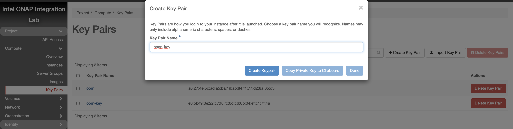

.. Note::
  If you're creating a new Key Pair, ensure to create a local copy of the
  Private Key through the use of "Copy Private Key to Clipboard".

For the purpose of this guide, we will assume a new local key called "onap-key"
has been downloaded and is copied into **~/.ssh/**, from which it can be
referenced.

Example::

  > mv onap-key ~/.ssh

  > chmod 600 ~/.ssh/onap-key

Create Network
==============

An internal network is required in order to deploy our VMs that will host
Kubernetes.

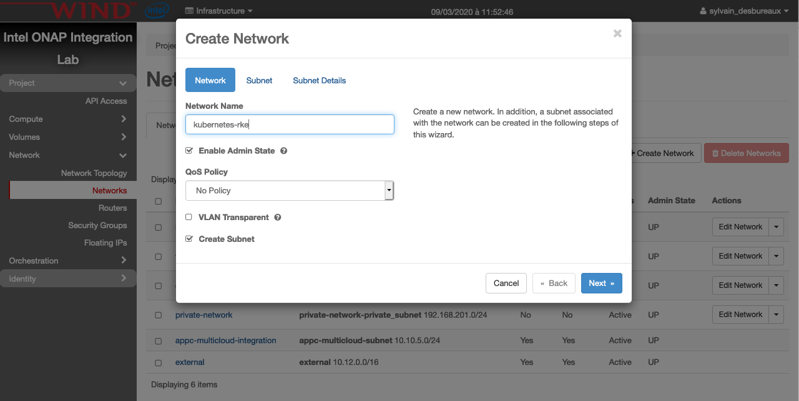

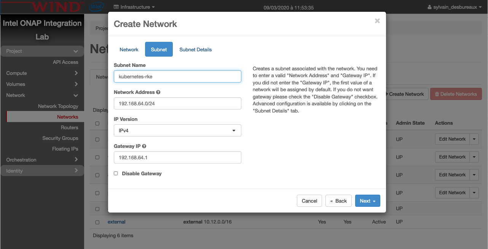

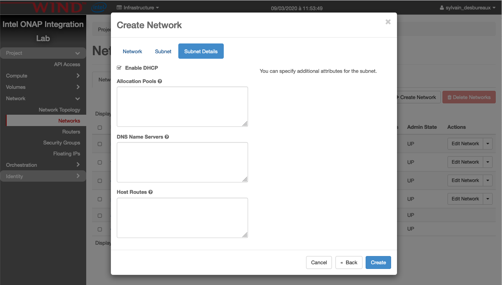

.. Note::
  It's better to have one network per deployment and obviously the name of this
  network should be unique.

Now we need to create a router to attach this network to outside:

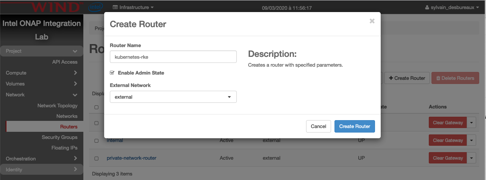

Create Security Group
=====================

A specific security group is also required

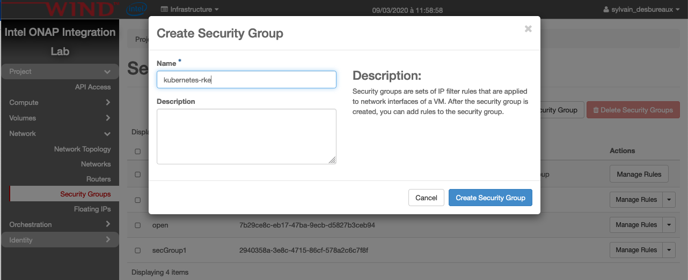

then click on `manage rules` of the newly created security group.
And finally click on `Add Rule` and create the following one:

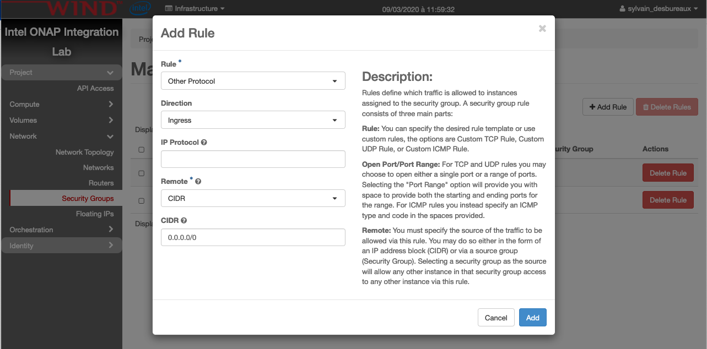

.. Note::
  the security is clearly not good here and the right SG will be proposed in a
  future version

Create Kubernetes Control Plane VMs
===================================

The following instructions describe how to create 3 OpenStack VMs to host the
Highly-Available Kubernetes Control Plane.
ONAP workloads will not be scheduled on these Control Plane nodes.

Launch new VM instances
-----------------------

.. image:: images/cp_vms/control_plane_1.png

Select Ubuntu 18.04 as base image
---------------------------------
Select "No" for "Create New Volume"

.. image:: images/cp_vms/control_plane_2.png

Select Flavor
-------------
The recommended flavor is at least 4 vCPU and 8GB ram.

.. image:: images/cp_vms/control_plane_3.png

Networking
----------

Use the created network:

.. image:: images/cp_vms/control_plane_4.png

Security Groups
---------------

Use the created security group:

.. image:: images/cp_vms/control_plane_5.png

Key Pair
--------
Assign the key pair that was created/selected previously (e.g. onap_key).

.. image:: images/cp_vms/control_plane_6.png

Apply customization script for Control Plane VMs
------------------------------------------------

Click :download:`openstack-k8s-controlnode.sh <shell/openstack-k8s-controlnode.sh>`
to download the script.

.. literalinclude:: shell/openstack-k8s-controlnode.sh
   :language: bash

This customization script will:

* update ubuntu
* install docker

.. image:: images/cp_vms/control_plane_7.png

Launch Instance
---------------

.. image:: images/cp_vms/control_plane_8.png

Create Kubernetes Worker VMs
============================
The following instructions describe how to create OpenStack VMs to host the
Highly-Available Kubernetes Workers. ONAP workloads will only be scheduled on
these nodes.

Launch new VM instances
-----------------------

The number and size of Worker VMs is dependent on the size of the ONAP
deployment. By default, all ONAP applications are deployed. It's possible to
customize the deployment and enable a subset of the ONAP applications. For the
purpose of this guide, however, we will deploy 12 Kubernetes Workers that have
been sized to handle the entire ONAP application workload.

.. image:: images/wk_vms/worker_1.png

Select Ubuntu 18.04 as base image
---------------------------------
Select "No" on "Create New Volume"

.. image:: images/wk_vms/worker_2.png

Select Flavor
-------------
The size of Kubernetes hosts depend on the size of the ONAP deployment
being installed.

If a small subset of ONAP applications are being deployed
(i.e. for testing purposes), then 16GB or 32GB may be sufficient.

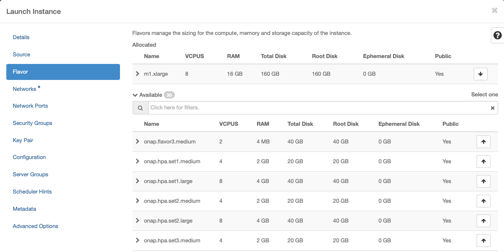

Networking
-----------

.. image:: images/wk_vms/worker_4.png

Security Group
---------------

.. image:: images/wk_vms/worker_5.png

Key Pair
--------
Assign the key pair that was created/selected previously (e.g. onap_key).

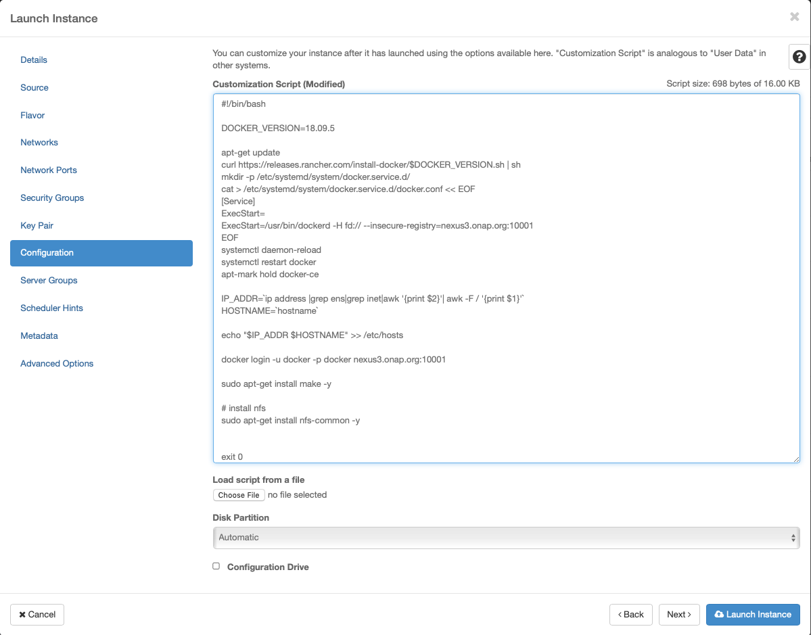

Apply customization script for Kubernetes VM(s)
-----------------------------------------------

Click :download:`openstack-k8s-workernode.sh <shell/openstack-k8s-workernode.sh>` to
download the script.

.. literalinclude:: shell/openstack-k8s-workernode.sh
   :language: bash

This customization script will:

* update ubuntu
* install docker
* install nfs common

Launch Instance
---------------

.. image:: images/wk_vms/worker_7.png

Assign Floating IP addresses
----------------------------
Assign Floating IPs to all Control Plane and Worker VMs.
These addresses provide external access to the VMs and will be used by RKE
to configure kubernetes on to the VMs.

Repeat the following for each VM previously created:

.. image:: images/floating_ips/floating_1.png

Resulting floating IP assignments in this example.

.. image:: images/floating_ips/floating_2.png

Configure Rancher Kubernetes Engine (RKE)
=========================================

Install RKE
-----------
Download and install RKE on a VM, desktop or laptop.
Binaries can be found here for Linux and Mac: https://github.com/rancher/rke/releases/tag/v1.0.6

.. note::
  There are several ways to install RKE. Further parts of this documentation
  assumes that you have rke command available.
  If you don't know how to install RKE you may follow the below steps:

  * chmod +x ./rke_linux-amd64
  * sudo mv ./rke_linux-amd64 /user/local/bin/rke

RKE requires a *cluster.yml* as input. An example file is show below that
describes a Kubernetes cluster that will be mapped onto the OpenStack VMs
created earlier in this guide.

Click :download:`cluster.yml <yaml/cluster.yml>` to download the
configuration file.

.. literalinclude:: yaml/cluster.yml
   :language: yaml

Prepare cluster.yml
-------------------
Before this configuration file can be used the external **address**
and the **internal_address** must be mapped for each control and worker node
in this file.

Run RKE
-------
From within the same directory as the cluster.yml file, simply execute::

  > rke up

The output will look something like::

  INFO[0000] Initiating Kubernetes cluster
  INFO[0000] [certificates] Generating admin certificates and kubeconfig
  INFO[0000] Successfully Deployed state file at [./cluster.rkestate]
  INFO[0000] Building Kubernetes cluster
  INFO[0000] [dialer] Setup tunnel for host [10.12.6.82]
  INFO[0000] [dialer] Setup tunnel for host [10.12.6.249]
  INFO[0000] [dialer] Setup tunnel for host [10.12.6.74]
  INFO[0000] [dialer] Setup tunnel for host [10.12.6.85]
  INFO[0000] [dialer] Setup tunnel for host [10.12.6.238]
  INFO[0000] [dialer] Setup tunnel for host [10.12.6.89]
  INFO[0000] [dialer] Setup tunnel for host [10.12.5.11]
  INFO[0000] [dialer] Setup tunnel for host [10.12.6.90]
  INFO[0000] [dialer] Setup tunnel for host [10.12.6.244]
  INFO[0000] [dialer] Setup tunnel for host [10.12.5.165]
  INFO[0000] [dialer] Setup tunnel for host [10.12.6.126]
  INFO[0000] [dialer] Setup tunnel for host [10.12.6.111]
  INFO[0000] [dialer] Setup tunnel for host [10.12.5.160]
  INFO[0000] [dialer] Setup tunnel for host [10.12.5.191]
  INFO[0000] [dialer] Setup tunnel for host [10.12.6.195]
  INFO[0002] [network] Deploying port listener containers
  INFO[0002] [network] Pulling image [nexus3.onap.org:10001/rancher/rke-tools:v0.1.27] on host [10.12.6.85]
  INFO[0002] [network] Pulling image [nexus3.onap.org:10001/rancher/rke-tools:v0.1.27] on host [10.12.6.89]
  INFO[0002] [network] Pulling image [nexus3.onap.org:10001/rancher/rke-tools:v0.1.27] on host [10.12.6.90]
  INFO[0011] [network] Successfully pulled image [nexus3.onap.org:10001/rancher/rke-tools:v0.1.27] on host [10.12.6.89]
  . . . .
  INFO[0309] [addons] Setting up Metrics Server
  INFO[0309] [addons] Saving ConfigMap for addon rke-metrics-addon to Kubernetes
  INFO[0309] [addons] Successfully saved ConfigMap for addon rke-metrics-addon to Kubernetes
  INFO[0309] [addons] Executing deploy job rke-metrics-addon
  INFO[0315] [addons] Metrics Server deployed successfully
  INFO[0315] [ingress] Setting up nginx ingress controller
  INFO[0315] [addons] Saving ConfigMap for addon rke-ingress-controller to Kubernetes
  INFO[0316] [addons] Successfully saved ConfigMap for addon rke-ingress-controller to Kubernetes
  INFO[0316] [addons] Executing deploy job rke-ingress-controller
  INFO[0322] [ingress] ingress controller nginx deployed successfully
  INFO[0322] [addons] Setting up user addons
  INFO[0322] [addons] no user addons defined
  INFO[0322] Finished building Kubernetes cluster successfully

Install Kubectl
===============

Download and install kubectl. Binaries can be found here for Linux and Mac:

https://storage.googleapis.com/kubernetes-release/release/v1.15.11/bin/linux/amd64/kubectl
https://storage.googleapis.com/kubernetes-release/release/v1.15.11/bin/darwin/amd64/kubectl

You only need to install kubectl where you'll launch Kubernetes command. This
can be any machines of the Kubernetes cluster or a machine that has IP access
to the APIs.
Usually, we use the first controller as it has also access to internal
Kubernetes services, which can be convenient.

Validate deployment
-------------------

::

  > mkdir -p ~/.kube

  > cp kube_config_cluster.yml ~/.kube/config.onap

  > export KUBECONFIG=~/.kube/config.onap

  > kubectl config use-context onap

  > kubectl get nodes -o=wide

::

  NAME             STATUS   ROLES               AGE     VERSION   INTERNAL-IP   EXTERNAL-IP   OS-IMAGE           KERNEL-VERSION      CONTAINER-RUNTIME
  onap-control-1   Ready    controlplane,etcd   3h53m   v1.15.2   10.0.0.8      <none>        Ubuntu 18.04 LTS   4.15.0-22-generic   docker://18.9.5
  onap-control-2   Ready    controlplane,etcd   3h53m   v1.15.2   10.0.0.11     <none>        Ubuntu 18.04 LTS   4.15.0-22-generic   docker://18.9.5
  onap-control-3   Ready    controlplane,etcd   3h53m   v1.15.2   10.0.0.12     <none>        Ubuntu 18.04 LTS   4.15.0-22-generic   docker://18.9.5
  onap-k8s-1       Ready    worker              3h53m   v1.15.2   10.0.0.14     <none>        Ubuntu 18.04 LTS   4.15.0-22-generic   docker://18.9.5
  onap-k8s-10      Ready    worker              3h53m   v1.15.2   10.0.0.16     <none>        Ubuntu 18.04 LTS   4.15.0-22-generic   docker://18.9.5
  onap-k8s-11      Ready    worker              3h53m   v1.15.2   10.0.0.18     <none>        Ubuntu 18.04 LTS   4.15.0-22-generic   docker://18.9.5
  onap-k8s-12      Ready    worker              3h53m   v1.15.2   10.0.0.7      <none>        Ubuntu 18.04 LTS   4.15.0-22-generic   docker://18.9.5
  onap-k8s-2       Ready    worker              3h53m   v1.15.2   10.0.0.26     <none>        Ubuntu 18.04 LTS   4.15.0-22-generic   docker://18.9.5
  onap-k8s-3       Ready    worker              3h53m   v1.15.2   10.0.0.5      <none>        Ubuntu 18.04 LTS   4.15.0-22-generic   docker://18.9.5
  onap-k8s-4       Ready    worker              3h53m   v1.15.2   10.0.0.6      <none>        Ubuntu 18.04 LTS   4.15.0-22-generic   docker://18.9.5
  onap-k8s-5       Ready    worker              3h53m   v1.15.2   10.0.0.9      <none>        Ubuntu 18.04 LTS   4.15.0-22-generic   docker://18.9.5
  onap-k8s-6       Ready    worker              3h53m   v1.15.2   10.0.0.17     <none>        Ubuntu 18.04 LTS   4.15.0-22-generic   docker://18.9.5
  onap-k8s-7       Ready    worker              3h53m   v1.15.2   10.0.0.20     <none>        Ubuntu 18.04 LTS   4.15.0-22-generic   docker://18.9.5
  onap-k8s-8       Ready    worker              3h53m   v1.15.2   10.0.0.10     <none>        Ubuntu 18.04 LTS   4.15.0-22-generic   docker://18.9.5
  onap-k8s-9       Ready    worker              3h53m   v1.15.2   10.0.0.4      <none>        Ubuntu 18.04 LTS   4.15.0-22-generic   docker://18.9.5

Install Helm
============

Example Helm client install on Linux::

  > wget https://get.helm.sh/helm-v2.16.6-linux-amd64.tar.gz

  > tar -zxvf helm-v2.16.6-linux-amd64.tar.gz

  > sudo mv linux-amd64/helm /usr/local/bin/helm

Initialize Kubernetes Cluster for use by Helm
---------------------------------------------

::

  > kubectl -n kube-system create serviceaccount tiller

  > kubectl create clusterrolebinding tiller --clusterrole=cluster-admin --serviceaccount=kube-system:tiller

  > helm init --service-account tiller

  > kubectl -n kube-system  rollout status deploy/tiller-deploy

Setting up an NFS share for Multinode Kubernetes Clusters
=========================================================
Deploying applications to a Kubernetes cluster requires Kubernetes nodes to
share a common, distributed filesystem. In this tutorial, we will setup an
NFS Master, and configure all Worker nodes a Kubernetes cluster to play
the role of NFS slaves.

It is recommended that a separate VM, outside of the kubernetes
cluster, be used. This is to ensure that the NFS Master does not compete for
resources with Kubernetes Control Plane or Worker Nodes.

Launch new NFS Server VM instance
---------------------------------
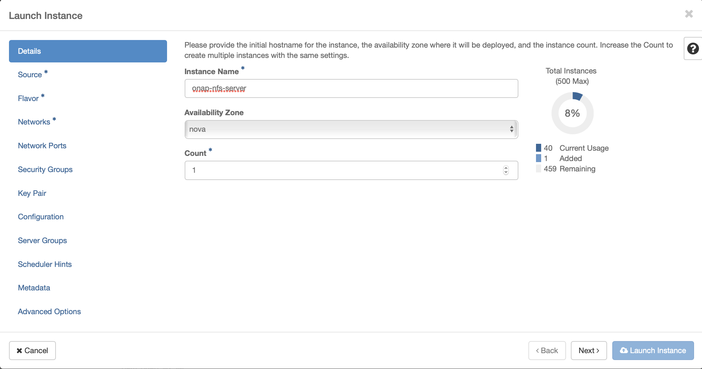

Select Ubuntu 18.04 as base image
---------------------------------
Select "No" on "Create New Volume"

.. image:: images/nfs_server/nfs_server_2.png

Select Flavor
-------------

.. image:: images/nfs_server/nfs_server_3.png

Networking
-----------

.. image:: images/nfs_server/nfs_server_4.png

Security Group
---------------

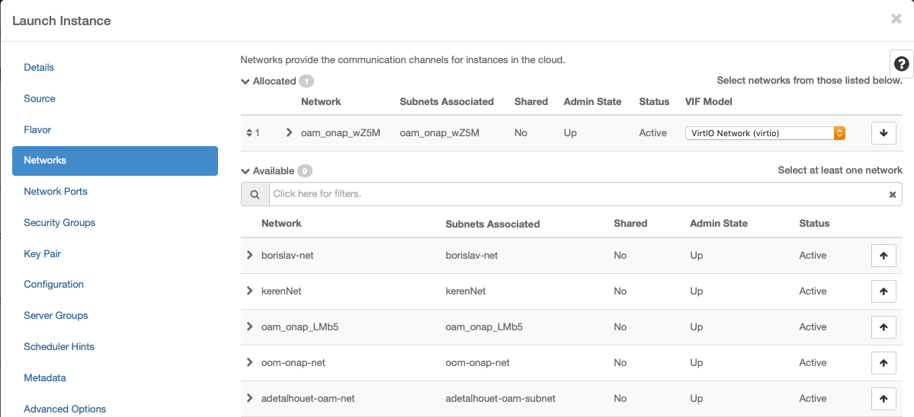

Key Pair
--------
Assign the key pair that was created/selected previously (e.g. onap_key).

.. image:: images/nfs_server/nfs_server_6.png

Apply customization script for NFS Server VM
--------------------------------------------

Click :download:`openstack-nfs-server.sh <shell/openstack-nfs-server.sh>` to download
the script.

.. literalinclude:: shell/openstack-nfs-server.sh
   :language: bash

This customization script will:

* update ubuntu
* install nfs server

Launch Instance
---------------

.. image:: images/nfs_server/nfs_server_7.png

Assign Floating IP addresses
----------------------------

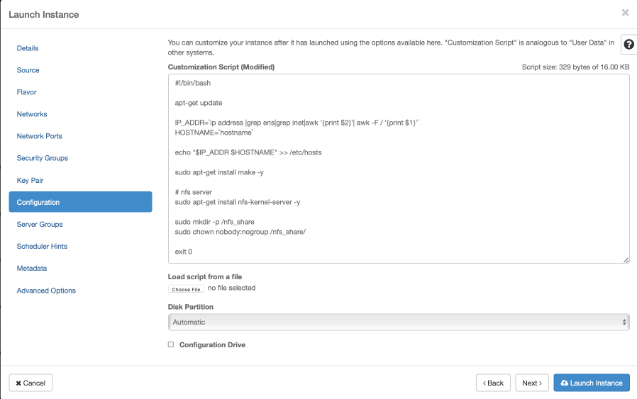

Resulting floating IP assignments in this example.

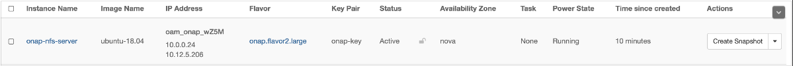

To properly set up an NFS share on Master and Slave nodes, the user can run the
scripts below.

Click :download:`master_nfs_node.sh <shell/master_nfs_node.sh>` to download the
script.

.. literalinclude:: shell/master_nfs_node.sh
   :language: bash

Click :download:`slave_nfs_node.sh <shell/slave_nfs_node.sh>` to download the script.

.. literalinclude:: shell/slave_nfs_node.sh
   :language: bash

The master_nfs_node.sh script runs in the NFS Master node and needs the list of
NFS Slave nodes as input, e.g.::

    > sudo ./master_nfs_node.sh node1_ip node2_ip ... nodeN_ip

The slave_nfs_node.sh script runs in each NFS Slave node and needs the IP of
the NFS Master node as input, e.g.::

    > sudo ./slave_nfs_node.sh master_node_ip

ONAP Deployment via OOM
=======================
Now that Kubernetes and Helm are installed and configured you can prepare to
deploy ONAP. Follow the instructions in the README.md_ or look at the official
documentation to get started:

- :ref:`quick-start-label` - deploy ONAP on an existing cloud
- :ref:`user-guide-label` - a guide for operators of an ONAP instance
