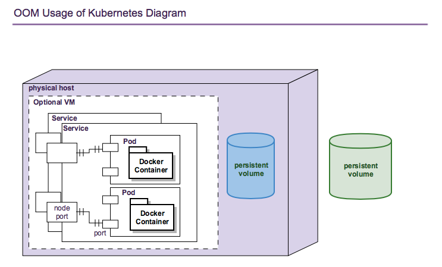
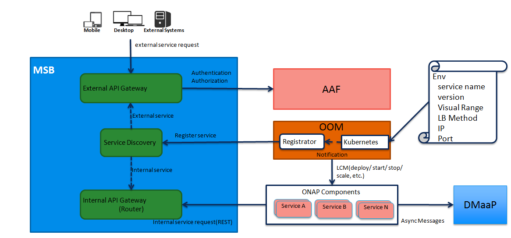

.. This work is licensed under a Creative Commons Attribution 4.0 International License.
.. http://creativecommons.org/licenses/by/4.0
.. Copyright 2018 Amdocs, Bell Canada

.. Links
.. _Helm: https://docs.helm.sh/
.. _Helm Charts: https://github.com/kubernetes/charts
.. _Kubernetes: https://Kubernetes.io/
.. _Docker: https://www.docker.com/
.. _Nexus: https://nexus.onap.org/#welcome
.. _AWS Elastic Block Store: https://aws.amazon.com/ebs/
.. _Azure File: https://docs.microsoft.com/en-us/azure/storage/files/storage-files-introduction
.. _GCE Persistent Disk: https://cloud.google.com/compute/docs/disks/
.. _Gluster FS: https://www.gluster.org/
.. _Kubernetes Storage Class: https://Kubernetes.io/docs/concepts/storage/storage-classes/
.. _Assigning Pods to Nodes: https://Kubernetes.io/docs/concepts/configuration/assign-pod-node/

.. _developer-guide-label:

OOM Developer Guide
###################

.. figure:: oomLogoV2-medium.png
   :align: right

ONAP consists of a large number of components, each of which are substantial
projects within themselves, which results in a high degree of complexity in
deployment and management. To cope with this complexity the ONAP Operations
Manager (OOM) uses a Helm_ model of ONAP - Helm being the primary management
system for Kubernetes_ container systems - to drive all user driven life-cycle
management operations. The Helm model of ONAP is composed of a set of
hierarchical Helm charts that define the structure of the ONAP components and
the configuration of these components.  These charts are fully parameterized
such that a single environment file defines all of the parameters needed to
deploy ONAP.  A user of ONAP may maintain several such environment files to
control the deployment of ONAP in multiple environments such as development,
pre-production, and production.

The following sections describe how the ONAP Helm charts are constructed.

.. contents::
   :depth: 3
   :local:
..

Container Background
====================
Linux containers allow for an application and all of its operating system
dependencies to be packaged and deployed as a single unit without including a
guest operating system as done with virtual machines. The most popular
container solution is Docker_ which provides tools for container management
like the Docker Host (dockerd) which can create, run, stop, move, or delete a
container. Docker has a very popular registry of containers images that can be
used by any Docker system; however, in the ONAP context, Docker images are
built by the standard CI/CD flow and stored in Nexus_ repositories. OOM uses
the "standard" ONAP docker containers and three new ones specifically created
for OOM.

Containers are isolated from each other primarily via name spaces within the
Linux kernel without the need for multiple guest operating systems. As such,
multiple containers can be deployed with little overhead such as all of ONAP
can be deployed on a single host. With some optimization of the ONAP components
(e.g. elimination of redundant database instances) it may be possible to deploy
ONAP on a single laptop computer.

Helm Charts
===========
A Helm chart is a collection of files that describe a related set of Kubernetes
resources. A simple chart might be used to deploy something simple, like a
memcached pod, while a complex chart might contain many micro-service arranged
in a hierarchy as found in the `aai` ONAP component.

Charts are created as files laid out in a particular directory tree, then they
can be packaged into versioned archives to be deployed. There is a public
archive of `Helm Charts`_ on GitHub that includes many technologies applicable
to ONAP. Some of these charts have been used in ONAP and all of the ONAP charts
have been created following the guidelines provided.

The top level of the ONAP charts is shown below:

.. graphviz::

   digraph onap_top_chart {
      rankdir="LR";
      {
        node      [shape=folder]
        oValues   [label="values.yaml"]
        oChart    [label="Chart.yaml"]
        dev       [label="dev.yaml"]
        prod      [label="prod.yaml"]
        crb       [label="clusterrolebindings.yaml"]
        secrets   [label="secrets.yaml"]
      }
      {
        node      [style=dashed]
        vCom      [label="component"]
      }

      onap         -> oValues
      onap         -> oChart
      onap         -> templates
      onap         -> resources
      oValues      -> vCom
      resources    -> environments
      environments -> dev
      environments -> prod
      templates    -> crb
      templates    -> secrets
   }

Within the `values.yaml` file at the `onap` level, one will find a set of
boolean values that control which of the ONAP components get deployed as shown
below:

.. code-block:: yaml

  aaf: # Application Authorization Framework
    enabled: false
  <...>
  so: # Service Orchestrator
    enabled: true

By setting these flags a custom deployment can be created and used during
deployment by using the `-f` Helm option as follows::

  > helm install local/onap -name development -f dev.yaml

Note that there are one or more example deployment files in the
`onap/resources/environments/` directory. It is best practice to create a unique
deployment file for each environment used to ensure consistent behaviour.

To aid in the long term supportability of ONAP, a set of common charts have
been created (and will be expanded in subsequent releases of ONAP) that can be
used by any of the ONAP components by including the common component in its
`requirements.yaml` file. The common components are arranged as follows:

.. graphviz::

   digraph onap_common_chart {
      rankdir="LR";
      {
         node      [shape=folder]
         mValues   [label="values.yaml"]
         ccValues  [label="values.yaml"]
         comValues [label="values.yaml"]
         comChart  [label="Chart.yaml"]
         ccChart   [label="Chart.yaml"]
         mChart    [label="Chart.yaml"]

         mReq      [label="requirements.yaml"]
         mService  [label="service.yaml"]
         mMap      [label="configmap.yaml"]
         ccName    [label="_name.tpl"]
         ccNS      [label="_namespace.tpl"]
      }
      {
         cCom       [label="common"]
         mTemp      [label="templates"]
         ccTemp     [label="templates"]
      }
      {
         more       [label="...",style=dashed]
      }

      common -> comValues
      common -> comChart
      common -> cCom
      common -> mysql
      common -> more

      cCom   -> ccChart
      cCom   -> ccValues
      cCom   -> ccTemp
      ccTemp -> ccName
      ccTemp -> ccNS

      mysql  -> mValues
      mysql  -> mChart
      mysql  -> mReq
      mysql  -> mTemp
      mTemp  -> mService
      mTemp  -> mMap
   }

The common section of charts consists of a set of templates that assist with
parameter substitution (`_name.tpl` and `_namespace.tpl`) and a set of charts
for components used throughout ONAP. Initially `mysql` is in the common area but
this will expand to include other databases like `mariadb-galera`, `postgres`,
and `cassandra`. Other candidates for common components include `redis` and
`kafka`.  When the common components are used by other charts they are
instantiated each time. In subsequent ONAP releases some of the common
components could be a setup as services that are used by multiple ONAP
components thus minimizing the deployment and operational costs.

All of the ONAP components have charts that follow the pattern shown below:

.. graphviz::

   digraph onap_component_chart {
      rankdir="LR";
      {
         node      [shape=folder]
         cValues   [label="values.yaml"]
         cChart    [label="Chart.yaml"]
         cService  [label="service.yaml"]
         cMap      [label="configmap.yaml"]
         cFiles    [label="config file(s)"]
      }
      {
         cCharts   [label="charts"]
         cTemp     [label="templates"]
         cRes      [label="resources"]

      }
      {
         sCom       [label="component",style=dashed]
      }

      component -> cValues
      component -> cChart
      component -> cCharts
      component -> cTemp
      component -> cRes
      cTemp     -> cService
      cTemp     -> cMap
      cRes      -> config
      config    -> cFiles
      cCharts   -> sCom
   }

Note that the component charts may include a hierarchy of components and in
themselves can be quite complex.

Configuration of the components varies somewhat from component to component but
generally follows the pattern of one or more `configmap.yaml` files which can
directly provide configuration to the containers in addition to processing
configuration files stored in the `config` directory.  It is the responsibility
of each ONAP component team to update these configuration files when changes
are made to the project containers that impact configuration.

The following section describes how the hierarchical ONAP configuration system is
key to management of such a large system.  

Configuration Management
========================

ONAP is a large system composed of many components - each of which are complex
systems in themselves - that needs to be deployed in a number of different
ways.  For example, within a single operator's network there may be R&D
deployments under active development, pre-production versions undergoing system
testing and production systems that are operating live networks.  Each of these
deployments will differ in significant ways, such as the version of the
software images deployed.  In addition, there may be a number of application
specific configuration differences, such as operating system environment
variables.  The following describes how the Helm configuration management
system is used within the OOM project to manage both ONAP infrastructure
configuration as well as ONAP components configuration.

One of the artifacts that OOM/Kubernetes uses to deploy ONAP components is the
deployment specification, yet another yaml file.  Within these deployment specs
are a number of parameters as shown in the following mariadb example:

.. code-block:: yaml

  apiVersion: extensions/v1beta1
  kind: Deployment
  metadata:
    name: mariadb
  spec:
     <...>
    template:
      <...>
      spec:
        hostname: mariadb
        containers:
        - args:
          image: nexus3.onap.org:10001/mariadb:10.1.11
          name: "mariadb"
          env:
            - name: MYSQL_ROOT_PASSWORD
              value: password
            - name: MARIADB_MAJOR
              value: "10.1"
          <...>
        imagePullSecrets:
        - name: onap-docker-registry-key

Note that within the deployment specification, one of the container arguments
is the key/value pair image: nexus3.onap.org:10001/mariadb:10.1.11 which
specifies the version of the mariadb software to deploy.  Although the
deployment specifications greatly simplify deployment, maintenance of the
deployment specifications themselves become problematic as software versions
change over time or as different versions are required for different
deployments.  For example, if the R&D team needs to deploy a newer version of
mariadb than what is currently used in the production environment, they would
need to clone the deployment specification and change this value.  Fortunately,
this problem has been solved with the templating capabilities of Helm.

The following example shows how the deployment specifications are modified to
incorporate Helm templates such that key/value pairs can be defined outside of
the deployment specifications and passed during instantiation of the component.

.. code-block:: yaml

  apiVersion: extensions/v1beta1
  kind: Deployment
  metadata:
    name: mariadb
    namespace: "{{ .Values.nsPrefix }}-mso"
  spec:
    <...>
    template:
      <...>
      spec:
        hostname: mariadb
        containers:
        - args:
          image: {{ .Values.image.mariadb }}
          imagePullPolicy: {{ .Values.pullPolicy }}
          name: "mariadb"
          env:
            - name: MYSQL_ROOT_PASSWORD
              value: password
            - name: MARIADB_MAJOR
              value: "10.1"
        <...>
        imagePullSecrets:
        - name: "{{ .Values.nsPrefix }}-docker-registry-key"apiVersion: extensions/v1beta1
  kind: Deployment
  metadata:
    name: mariadb
    namespace: "{{ .Values.nsPrefix }}-mso"
  spec:
    <...>
    template:
      <...>
      spec:
        hostname: mariadb
        containers:
        - args:
          image: {{ .Values.image.mariadb }}
          imagePullPolicy: {{ .Values.pullPolicy }}
          name: "mariadb"
          env:
            - name: MYSQL_ROOT_PASSWORD
              value: password
            - name: MARIADB_MAJOR
              value: "10.1"
        <...>
        imagePullSecrets:
        - name: "{{ .Values.nsPrefix }}-docker-registry-key"

This version of the deployment specification has gone through the process of
templating values that are likely to change between deployments. Note that the
image is now specified as: image: {{ .Values.image.mariadb }} instead of a
string used previously.  During the deployment phase, Helm (actually the Helm
sub-component Tiller) substitutes the {{ .. }} entries with a variable defined
in a values.yaml file.  The content of this file is as follows:

.. code-block:: yaml

  nsPrefix: onap
  pullPolicy: IfNotPresent
  image:
    readiness: oomk8s/readiness-check:2.0.0
    mso: nexus3.onap.org:10001/openecomp/mso:1.0-STAGING-latest
    mariadb: nexus3.onap.org:10001/mariadb:10.1.11

Within the values.yaml file there is an image section with the key/value pair
mariadb: nexus3.onap.org:10001/mariadb:10.1.11 which is the same value used in
the non-templated version.  Once all of the substitutions are complete, the
resulting deployment specification ready to be used by Kubernetes.

Also note that in this example, the namespace key/value pair is specified in
the values.yaml file.  This key/value pair will be global across the entire
ONAP deployment and is therefore a prime example of where configuration
hierarchy can be very useful.

When creating a deployment template consider the use of default values if
appropriate.  Helm templating has built in support for DEFAULT values, here is
an example:

.. code-block:: yaml

  imagePullSecrets:
  - name: "{{ .Values.nsPrefix | default "onap" }}-docker-registry-key"

The pipeline operator ("|") used here hints at that power of Helm templates in
that much like an operating system command line the pipeline operator allow
over 60 Helm functions to be embedded directly into the template (note that the
Helm template language is a superset of the Go template language).  These
functions include simple string operations like upper and more complex flow
control operations like if/else.

ONAP Application Configuration
------------------------------

Dependency Management
---------------------
These Helm charts describe the desired state
of an ONAP deployment and instruct the Kubernetes container manager as to how
to maintain the deployment in this state.  These dependencies dictate the order
in-which the containers are started for the first time such that such
dependencies are always met without arbitrary sleep times between container
startups.  For example, the SDC back-end container requires the Elastic-Search,
Cassandra and Kibana containers within SDC to be ready and is also dependent on
DMaaP (or the message-router) to be ready - where ready implies the built-in
"readiness" probes succeeded - before becoming fully operational.  When an
initial deployment of ONAP is requested the current state of the system is NULL
so ONAP is deployed by the Kubernetes manager as a set of Docker containers on
one or more predetermined hosts.  The hosts could be physical machines or
virtual machines.  When deploying on virtual machines the resulting system will
be very similar to "Heat" based deployments, i.e. Docker containers running
within a set of VMs, the primary difference being that the allocation of
containers to VMs is done dynamically with OOM and statically with "Heat".
Example SO deployment descriptor file shows SO's dependency on its mariadb
data-base component:

SO deployment specification excerpt:

.. code-block:: yaml

  apiVersion: extensions/v1beta1
  kind: Deployment
  metadata:
    name: {{ include "common.name" . }}
    namespace: {{ include "common.namespace" . }}
    labels:
      app: {{ include "common.name" . }}
      chart: {{ .Chart.Name }}-{{ .Chart.Version | replace "+" "_" }}
      release: {{ .Release.Name }}
      heritage: {{ .Release.Service }}
  spec:
    replicas: {{ .Values.replicaCount }}
    template:
      metadata:
        labels:
          app: {{ include "common.name" . }}
          release: {{ .Release.Name }}
      spec:
        initContainers:
        - command:
          - /root/ready.py
          args:
          - --container-name
          - so-mariadb
          env:
  ...

Kubernetes Container Orchestration
==================================
The ONAP components are managed by the Kubernetes_ container management system
which maintains the desired state of the container system as described by one
or more deployment descriptors - similar in concept to OpenStack HEAT
Orchestration Templates. The following sections describe the fundamental
objects managed by Kubernetes, the network these components use to communicate
with each other and other entities outside of ONAP and the templates that
describe the configuration and desired state of the ONAP components.

Name Spaces
-----------
Within the namespaces are Kubernetes services that provide external connectivity to pods that host Docker containers.

ONAP Components to Kubernetes Object Relationships
--------------------------------------------------
Kubernetes deployments consist of multiple objects:

- **nodes** - a worker machine - either physical or virtual - that hosts
  multiple containers managed by Kubernetes.
- **services** - an abstraction of a logical set of pods that provide a
  micro-service.
- **pods** - one or more (but typically one) container(s) that provide specific
  application functionality.
- **persistent volumes** - One or more permanent volumes need to be established
  to hold non-ephemeral configuration and state data.

The relationship between these objects is shown in the following figure:

.. .. uml::
..
..   @startuml
..   node PH {
..      component Service {
..         component Pod0
..         component Pod1
..      }
..   }
..
..   database PV
..   @enduml

OOM uses these Kubernetes objects as described in the following sections.

Nodes
~~~~~
OOM works with both physical and virtual worker machines.

* Virtual Machine Deployments - If ONAP is to be deployed onto a set of virtual
  machines, the creation of the VMs is outside of the scope of OOM and could be
  done in many ways, such as

  * manually, for example by a user using the OpenStack Horizon dashboard or
    AWS EC2, or
  * automatically, for example with the use of a OpenStack Heat Orchestration
    Template which builds an ONAP stack, Azure ARM template, AWS CloudFormation
    Template, or
  * orchestrated, for example with Cloudify creating the VMs from a TOSCA
    template and controlling their life cycle for the life of the ONAP
    deployment.

* Physical Machine Deployments - If ONAP is to be deployed onto physical
  machines there are several options but the recommendation is to use Rancher
  along with Helm to associate hosts with a Kubernetes cluster.

Pods
~~~~
A group of containers with shared storage and networking can be grouped
together into a Kubernetes pod.  All of the containers within a pod are
co-located and co-scheduled so they operate as a single unit.  Within ONAP
Amsterdam release, pods are mapped one-to-one to docker containers although
this may change in the future.  As explained in the Services section below the
use of Pods within each ONAP component is abstracted from other ONAP
components.

Services
~~~~~~~~
OOM uses the Kubernetes service abstraction to provide a consistent access
point for each of the ONAP components independent of the pod or container
architecture of that component.  For example, the SDNC component may introduce
OpenDaylight clustering as some point and change the number of pods in this
component to three or more but this change will be isolated from the other ONAP
components by the service abstraction.  A service can include a load balancer
on its ingress to distribute traffic between the pods and even react to dynamic
changes in the number of pods if they are part of a replica set.

Persistent Volumes
~~~~~~~~~~~~~~~~~~
To enable ONAP to be deployed into a wide variety of cloud infrastructures a
flexible persistent storage architecture, built on Kubernetes persistent
volumes, provides the ability to define the physical storage in a central
location and have all ONAP components securely store their data.

When deploying ONAP into a public cloud, available storage services such as
`AWS Elastic Block Store`_, `Azure File`_, or `GCE Persistent Disk`_ are
options.  Alternatively, when deploying into a private cloud the storage
architecture might consist of Fiber Channel, `Gluster FS`_, or iSCSI. Many
other storage options existing, refer to the `Kubernetes Storage Class`_
documentation for a full list of the options. The storage architecture may vary
from deployment to deployment but in all cases a reliable, redundant storage
system must be provided to ONAP with which the state information of all ONAP
components will be securely stored. The Storage Class for a given deployment is
a single parameter listed in the ONAP values.yaml file and therefore is easily
customized. Operation of this storage system is outside the scope of the OOM.

.. code-block:: yaml

  Insert values.yaml code block with storage block here

Once the storage class is selected and the physical storage is provided, the
ONAP deployment step creates a pool of persistent volumes within the given
physical storage that is used by all of the ONAP components. ONAP components
simply make a claim on these persistent volumes (PV), with a persistent volume
claim (PVC), to gain access to their storage.

The following figure illustrates the relationships between the persistent
volume claims, the persistent volumes, the storage class, and the physical
storage.

.. graphviz::

   digraph PV {
      label = "Persistance Volume Claim to Physical Storage Mapping"
      {
         node [shape=cylinder]
         D0 [label="Drive0"]
         D1 [label="Drive1"]
         Dx [label="Drivex"]
      }
      {
         node [shape=Mrecord label="StorageClass:ceph"]
         sc
      }
      {
         node [shape=point]
         p0 p1 p2
         p3 p4 p5
      }
      subgraph clusterSDC {
         label="SDC"
         PVC0
         PVC1
      }
      subgraph clusterSDNC {
         label="SDNC"
         PVC2
      }
      subgraph clusterSO {
         label="SO"
         PVCn
      }
      PV0 -> sc
      PV1 -> sc
      PV2 -> sc
      PVn -> sc

      sc -> {D0 D1 Dx}
      PVC0 -> PV0
      PVC1 -> PV1
      PVC2 -> PV2
      PVCn -> PVn

      # force all of these nodes to the same line in the given order
      subgraph {
         rank = same; PV0;PV1;PV2;PVn;p0;p1;p2
         PV0->PV1->PV2->p0->p1->p2->PVn [style=invis]
      }

      subgraph {
         rank = same; D0;D1;Dx;p3;p4;p5
         D0->D1->p3->p4->p5->Dx [style=invis]
      }

   }

In-order for an ONAP component to use a persistent volume it must make a claim
against a specific persistent volume defined in the ONAP common charts.  Note
that there is a one-to-one relationship between a PVC and PV.  The following is
an excerpt from a component chart that defines a PVC:

.. code-block:: yaml

  Insert PVC example here

OOM Networking with Kubernetes
------------------------------

- DNS
- Ports - Flattening the containers also expose port conflicts between the containers which need to be resolved.

Node Ports
~~~~~~~~~~

Pod Placement Rules
-------------------
OOM will use the rich set of Kubernetes node and pod affinity /
anti-affinity rules to minimize the chance of a single failure resulting in a
loss of ONAP service. Node affinity / anti-affinity is used to guide the
Kubernetes orchestrator in the placement of pods on nodes (physical or virtual
machines).  For example:

- if a container used Intel DPDK technology the pod may state that it as
  affinity to an Intel processor based node, or
- geographical based node labels (such as the Kubernetes standard zone or
  region labels) may be used to ensure placement of a DCAE complex close to the
  VNFs generating high volumes of traffic thus minimizing networking cost.
  Specifically, if nodes were pre-assigned labels East and West, the pod
  deployment spec to distribute pods to these nodes would be:

.. code-block:: yaml

  nodeSelector:
    failure-domain.beta.Kubernetes.io/region: {{ .Values.location }}

- "location: West" is specified in the `values.yaml` file used to deploy
  one DCAE cluster and  "location: East" is specified in a second `values.yaml`
  file (see OOM Configuration Management for more information about
  configuration files like the `values.yaml` file).

Node affinity can also be used to achieve geographic redundancy if pods are
assigned to multiple failure domains. For more information refer to `Assigning
Pods to Nodes`_.

.. note::
   One could use Pod to Node assignment to totally constrain Kubernetes when
   doing initial container assignment to replicate the Amsterdam release
   OpenStack Heat based deployment. Should one wish to do this, each VM would
   need a unique node name which would be used to specify a node constaint
   for every component.  These assignment could be specified in an environment
   specific values.yaml file. Constraining Kubernetes in this way is not
   recommended.

Kubernetes has a comprehensive system called Taints and Tolerations that can be
used to force the container orchestrator to repel pods from nodes based on
static events (an administrator assigning a taint to a node) or dynamic events
(such as a node becoming unreachable or running out of disk space). There are
no plans to use taints or tolerations in the ONAP Beijing release.  Pod
affinity / anti-affinity is the concept of creating a spacial relationship
between pods when the Kubernetes orchestrator does assignment (both initially
an in operation) to nodes as explained in Inter-pod affinity and anti-affinity.
For example, one might choose to co-located all of the ONAP SDC containers on a
single node as they are not critical runtime components and co-location
minimizes overhead. On the other hand, one might choose to ensure that all of
the containers in an ODL cluster (SDNC and APPC) are placed on separate nodes
such that a node failure has minimal impact to the operation of the cluster.
An example of how pod affinity / anti-affinity is shown below:

Pod Affinity / Anti-Affinity

.. code-block:: yaml

  apiVersion: v1
  kind: Pod
  metadata:
    name: with-pod-affinity
  spec:
    affinity:
      podAffinity:
        requiredDuringSchedulingIgnoredDuringExecution:
        - labelSelector:
            matchExpressions:
        - key: security
          operator: In
          values:
          - S1
          topologyKey: failure-domain.beta.Kubernetes.io/zone
      podAntiAffinity:
        preferredDuringSchedulingIgnoredDuringExecution:
        - weight: 100
          podAffinityTerm:
            labelSelector:
              matchExpressions:
              - key: security
                operator: In
                values:
                - S2
            topologyKey: Kubernetes.io/hostname
       containers:
       - name: with-pod-affinity
         image: gcr.io/google_containers/pause:2.0

This example contains both podAffinity and podAntiAffinity rules, the first
rule is is a must (requiredDuringSchedulingIgnoredDuringExecution) while the
second will be met pending other considerations
(preferredDuringSchedulingIgnoredDuringExecution).  Preemption Another feature
that may assist in achieving a repeatable deployment in the presence of faults
that may have reduced the capacity of the cloud is assigning priority to the
containers such that mission critical components have the ability to evict less
critical components.  Kubernetes provides this capability with Pod Priority and
Preemption.  Prior to having more advanced production grade features available,
the ability to at least be able to re-deploy ONAP (or a subset of) reliably
provides a level of confidence that should an outage occur the system can be
brought back on-line predictably.

Health Checks
-------------

Monitoring of ONAP components is configured in the agents within JSON files and
stored in gerrit under the consul-agent-config, here is an example from the AAI
model loader (aai-model-loader-health.json):

.. code-block:: json

  {
    "service": {
      "name": "A&AI Model Loader",
      "checks": [
        {
          "id": "model-loader-process",
          "name": "Model Loader Presence",
          "script": "/consul/config/scripts/model-loader-script.sh",
          "interval": "15s",
          "timeout": "1s"
        }
      ]
    }
  }

Liveness Probes
---------------

These liveness probes can simply check that a port is available, that a
built-in health check is reporting good health, or that the Consul health check
is positive.  For example, to monitor the SDNC component has following liveness
probe can be found in the SDNC DB deployment specification:

.. code-block:: yaml

  sdnc db liveness probe

  livenessProbe:
    exec:
      command: ["mysqladmin", "ping"]
      initialDelaySeconds: 30 periodSeconds: 10
      timeoutSeconds: 5

The 'initialDelaySeconds' control the period of time between the readiness
probe succeeding and the liveness probe starting. 'periodSeconds' and
'timeoutSeconds' control the actual operation of the probe.  Note that
containers are inherently ephemeral so the healing action destroys failed
containers and any state information within it.  To avoid a loss of state, a
persistent volume should be used to store all data that needs to be persisted
over the re-creation of a container.  Persistent volumes have been created for
the database components of each of the projects and the same technique can be
used for all persistent state information.

Environment Files
~~~~~~~~~~~~~~~~~

MSB Integration
===============

The \ `Microservices Bus
Project <https://wiki.onap.org/pages/viewpage.action?pageId=3246982>`__ provides
facilities to integrate micro-services into ONAP and therefore needs to
integrate into OOM - primarily through Consul which is the backend of
MSB service discovery. The following is a brief description of how this
integration will be done:

A registrator to push the service endpoint info to MSB service
discovery. 

-  The needed service endpoint info is put into the kubernetes yaml file
   as annotation, including service name, Protocol,version, visual
   range,LB method, IP, Port,etc.

-  OOM deploy/start/restart/scale in/scale out/upgrade ONAP components

-  Registrator watch the kubernetes event

-  When an ONAP component instance has been started/destroyed by OOM,
   Registrator get the notification from kubernetes

-  Registrator parse the service endpoint info from annotation and
   register/update/unregister it to MSB service discovery

-  MSB API Gateway uses the service endpoint info for service routing
   and load balancing.

Details of the registration service API can be found at \ `Microservice
Bus API
Documentation <https://wiki.onap.org/display/DW/Microservice+Bus+API+Documentation>`__.

ONAP Component Registration to MSB
----------------------------------
The charts of all ONAP components intending to register against MSB must have
an annotation in their service(s) template.  A `sdc` example follows:

.. code-block:: yaml

  apiVersion: v1
  kind: Service
  metadata:
    labels:
      app: sdc-be
    name: sdc-be
    namespace: "{{ .Values.nsPrefix }}"
    annotations:
      msb.onap.org/service-info: '[
        {
            "serviceName": "sdc",
            "version": "v1",
            "url": "/sdc/v1",
            "protocol": "REST",
            "port": "8080",
            "visualRange":"1"
        },
        {
            "serviceName": "sdc-deprecated",
            "version": "v1",
            "url": "/sdc/v1",
            "protocol": "REST",
            "port": "8080",
            "visualRange":"1",
            "path":"/sdc/v1"
        }
        ]'
  ...

MSB Integration with OOM
------------------------
A preliminary view of the OOM-MSB integration is as follows:

A message sequence chart of the registration process:

.. uml::

  participant "OOM" as oom
  participant "ONAP Component" as onap
  participant "Service Discovery" as sd
  participant "External API Gateway" as eagw
  participant "Router (Internal API Gateway)" as iagw

  box "MSB" #LightBlue
    participant sd
    participant eagw
    participant iagw
  end box

  == Deploy Servcie ==

  oom -> onap: Deploy
  oom -> sd:   Register service endpoints
  sd -> eagw:  Services exposed to external system
  sd -> iagw:  Services for internal use

  == Component Life-cycle Management ==

  oom -> onap: Start/Stop/Scale/Migrate/Upgrade
  oom -> sd:   Update service info
  sd -> eagw:  Update service info
  sd -> iagw:  Update service info

  == Service Health Check ==

  sd -> onap: Check the health of service
  sd -> eagw: Update service status
  sd -> iagw: Update service status

MSB Deployment Instructions
---------------------------
MSB is helm installable ONAP component which is often automatically deployed.
To install it individually enter::

  > helm install <repo-name>/msb

.. note::
  TBD: Vaidate if the following procedure is still required.

Please note that Kubernetes authentication token must be set at
*kubernetes/kube2msb/values.yaml* so the kube2msb registrator can get the
access to watch the kubernetes events and get service annotation by
Kubernetes APIs. The token can be found in the kubectl configuration file
*~/.kube/config*

More details can be found here `MSB installation <http://onap.readthedocs.io/en/latest/submodules/msb/apigateway.git/docs/platform/installation.html>`__.

.. MISC
.. ====
.. Note that although OOM uses Kubernetes facilities to minimize the effort
.. required of the ONAP component owners to implement a successful rolling upgrade
.. strategy there are other considerations that must be taken into consideration.
.. For example, external APIs - both internal and external to ONAP - should be
.. designed to gracefully accept transactions from a peer at a different software
.. version to avoid deadlock situations. Embedded version codes in messages may
.. facilitate such capabilities.
..
.. Within each of the projects a new configuration repository contains all of the
.. project specific configuration artifacts.  As changes are made within the
.. project, it's the responsibility of the project team to make appropriate
.. changes to the configuration data.
