.. This work is licensed under a Creative Commons Attribution 4.0 International License.
.. http://creativecommons.org/licenses/by/4.0
.. Copyright 2018 Amdocs, Bell Canada

.. Links
.. _HELM Best Practices Guide: https://docs.helm.sh/chart_best_practices/#requirements
.. _kubectl Cheat Sheet: https://kubernetes.io/docs/reference/kubectl/cheatsheet/
.. _Kubernetes documentation for emptyDir: https://kubernetes.io/docs/concepts/storage/volumes/#emptydir
.. _Docker DevOps: https://wiki.onap.org/display/DW/Docker+DevOps#DockerDevOps-DockerBuild
.. _http://cd.onap.info:30223/mso/logging/debug: http://cd.onap.info:30223/mso/logging/debug
.. _Onboarding and Distributing a Vendor Software Product: https://wiki.onap.org/pages/viewpage.action?pageId=1018474
.. _README.md: https://gerrit.onap.org/r/gitweb?p=oom.git;a=blob;f=kubernetes/README.md

.. figure:: oomLogoV2-medium.png
   :align: right

.. _onap-on-kubernetes-with-rancher:

ONAP on Kubernetes with Rancher
###############################

The following instructions will step you through the installation of Kubernetes
on an OpenStack environment with Rancher.  The development lab used for this
installation is the ONAP Windriver lab.

This guide does not cover all of the steps required to setup your OpenStack
environment: e.g. OAM networks and security groups but there is a wealth of
OpenStack information on the web.

Rancher Installation
====================

The following instructions describe how to create an Openstack VM running
Rancher. This node will not be used to host ONAP itself, it will be used
exclusively by Rancher.

Launch new VM instance to host the Rancher Server
-------------------------------------------------

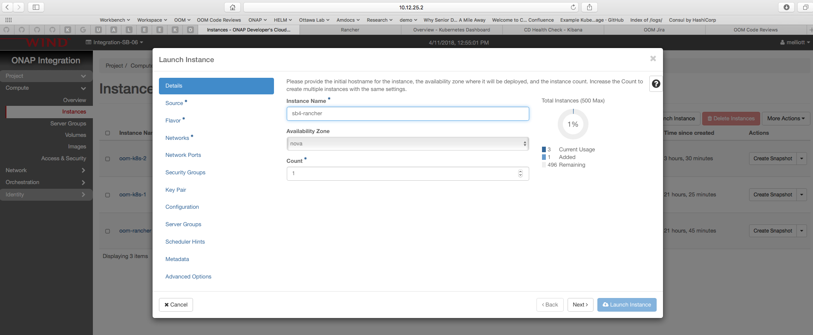

Select Ubuntu 16.04 as base image
---------------------------------
Select "No" on "Create New Volume"

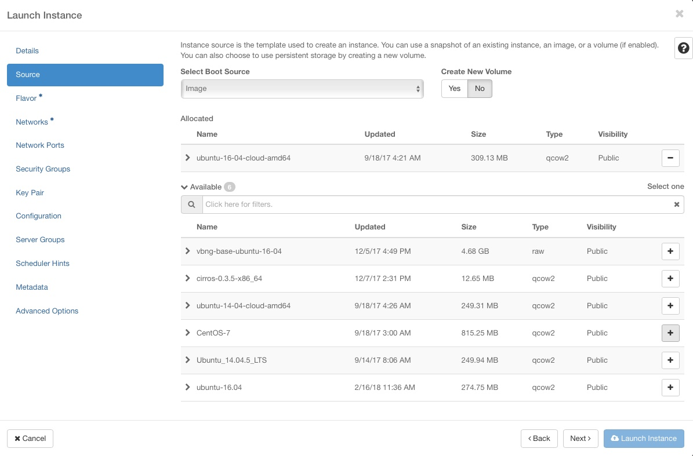

Select Flavor
-------------
Known issues exist if flavor is too small for Rancher. Please select a flavor
with at least 4 vCPU and 8GB ram.

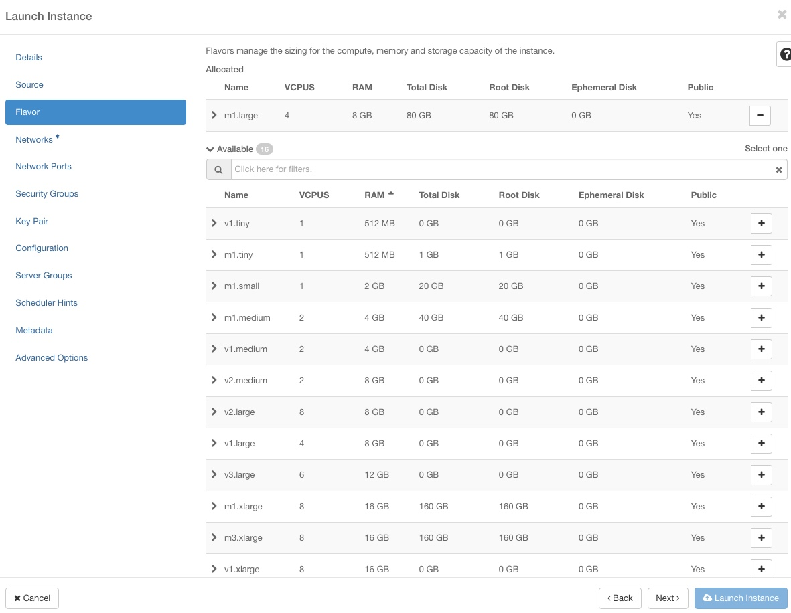

Networking
----------

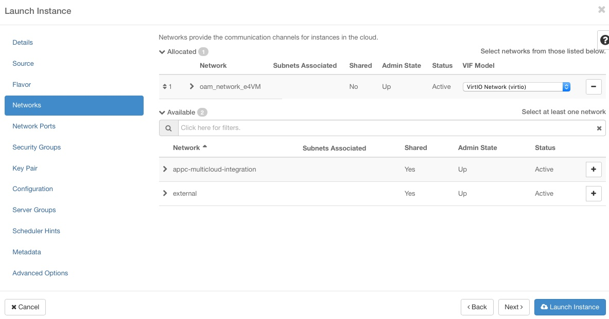

Security Groups
---------------

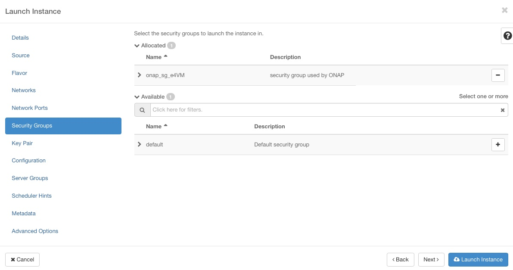

Key Pair
--------
Use an existing key pair (e.g. onap_key), import an existing one or create a
new one to assign.

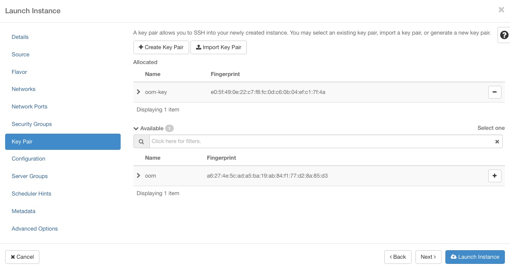

Apply customization script for the Rancher VM
---------------------------------------------

Click :download:`openstack-rancher.sh <openstack-rancher.sh>` to download the script.

.. literalinclude:: openstack-rancher.sh
   :language: bash

This customization script will:

* setup root access to the VM (comment out if you wish to disable this
  capability and restrict access to ssh access only)
* install docker
* install rancher
* install kubectl
* install helm
* install nfs server

.. note::
  The Beijing release of OOM only supports Helm 2.8.2 not the 2.7.2 shown in
  the screen capture below. The supported versions of all the software components
  are listed in the :ref:`cloud-setup-guide-label`.

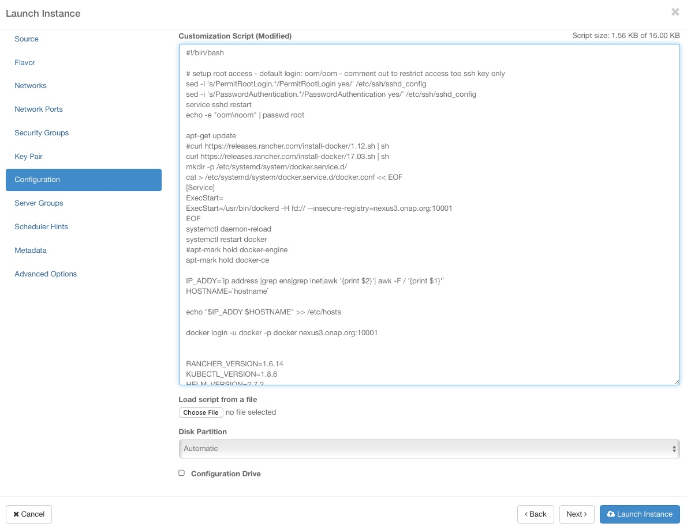

Launch Instance
---------------

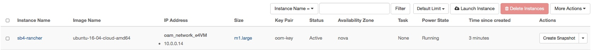

Assign Floating IP for external access
--------------------------------------

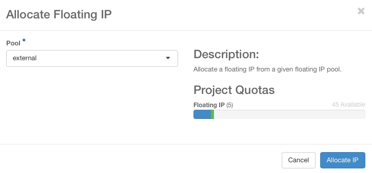

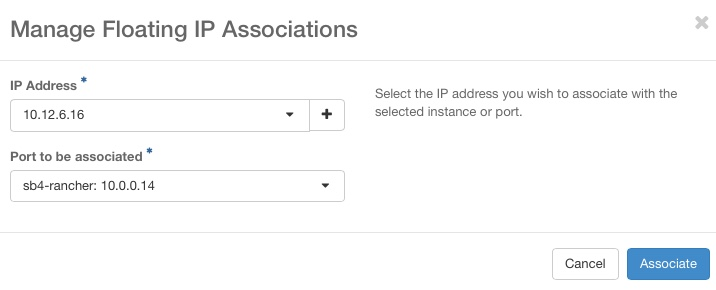

Kubernetes Installation
=======================

Launch new VM instance(s) to create a Kubernetes single host or cluster
-----------------------------------------------------------------------

To create a cluster:

.. note::
  #. do not append a '-1' suffix (e.g. sb4-k8s)
  #. increase count to the # of of kubernetes worker nodes you want (eg. 3)

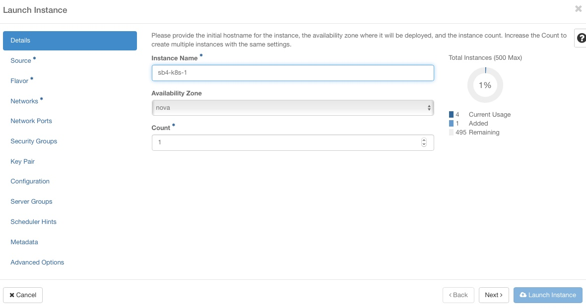

Select Ubuntu 16.04 as base image
---------------------------------
Select "No" on "Create New Volume"

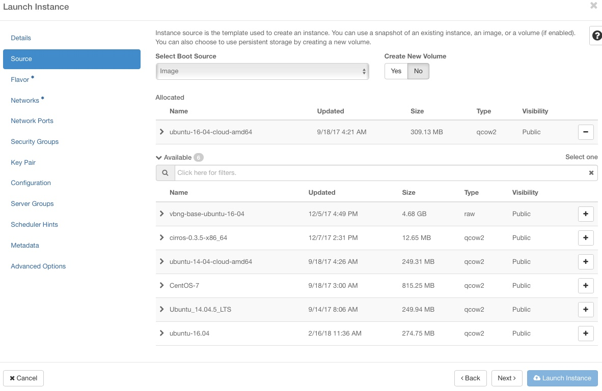

Select Flavor
-------------
The size of a Kubernetes host depends on the size of the ONAP deployment that
will be installed.

As of the Beijing release a minimum of 3 x 32GB hosts will be needed to run a
full ONAP deployment (all components).

If a small subset of ONAP components are being deployed for testing purposes,
then a single 16GB or 32GB host should suffice.

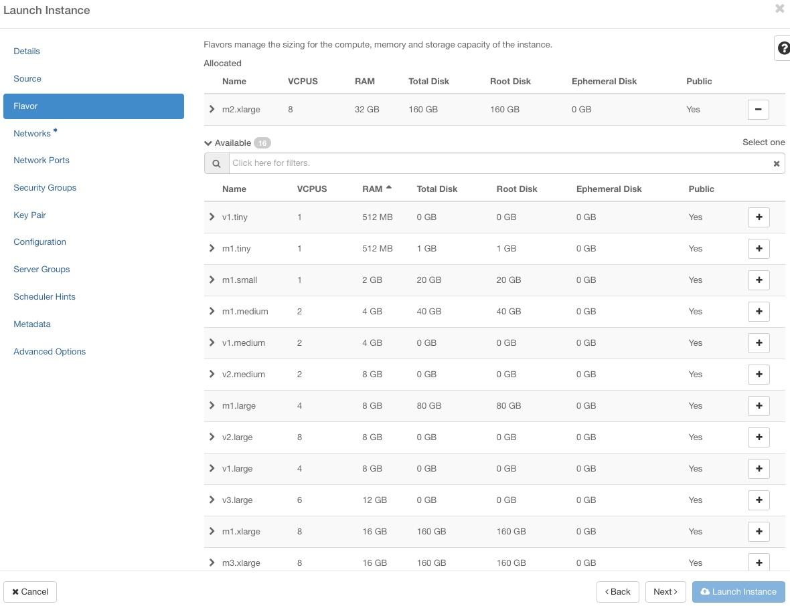

Networking
-----------

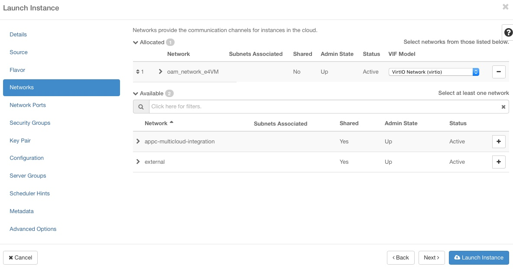

Security Group
---------------

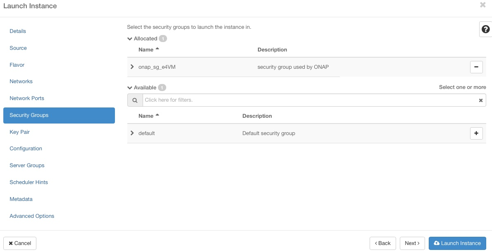

Key Pair
--------
Use an existing key pair (e.g. onap_key), import an existing one or create a
new one to assign.

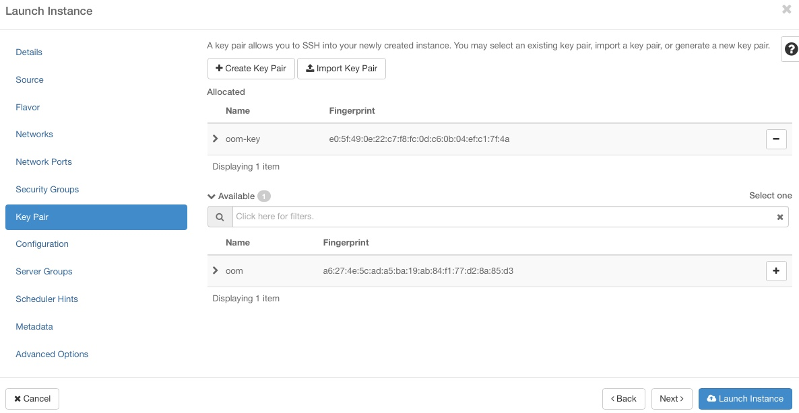

Apply customization script for Kubernetes VM(s)
-----------------------------------------------

Click :download:`openstack-k8s-node.sh <openstack-k8s-node.sh>` to
download the script.

.. literalinclude:: openstack-k8s-node.sh
   :language: bash

This customization script will:

* setup root access to the VM (comment out if you wish to disable this
  capability and restrict access to ssh access only)
* install docker
* install kubectl
* install helm
* install nfs common (see configuration step here)

.. note::
  Ensure you are using the correct versions as described in the
  :ref:`cloud-setup-guide-label`

Launch Instance
---------------

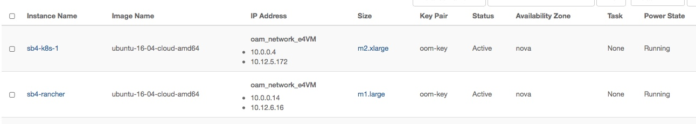

Assign Floating IP for external access
--------------------------------------

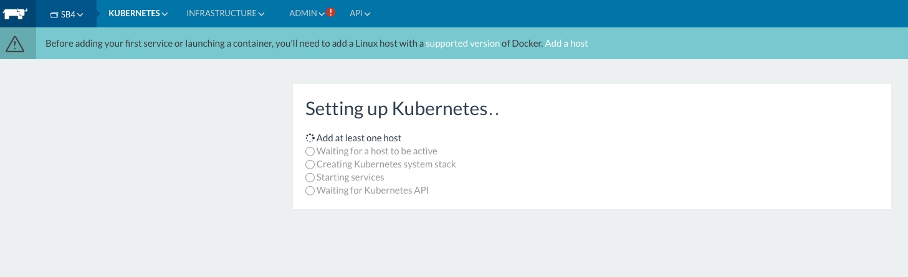

.. image:: K8s-Manage_Floating_IP_Associations.jpeg

Setting up an NFS share for Multinode Kubernetes Clusters
=========================================================
The figure below illustrates a possible topology of a multinode Kubernetes
cluster.

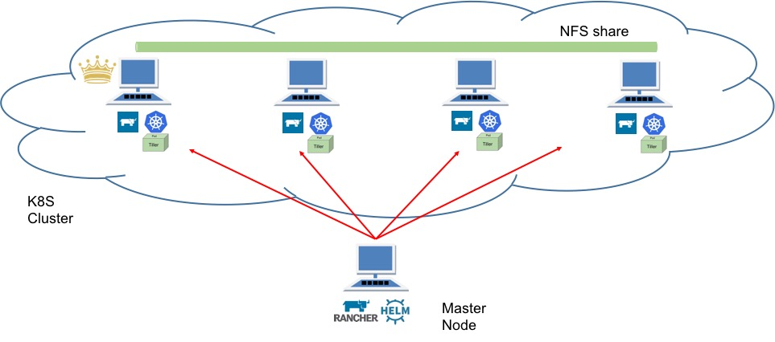

One node, the Master Node, runs Rancher and Helm clients and connects to all
the Kubernetes nodes in the cluster. Kubernetes nodes, in turn, run Rancher,
Kubernetes and Tiller (Helm) agents, which receive, execute, and respond to
commands issued by the Master Node (e.g. kubectl or helm operations). Note that
the Master Node can be either a remote machine that the user can log in to or a
local machine (e.g. laptop, desktop) that has access to the Kubernetes cluster.

Deploying applications to a Kubernetes cluster requires Kubernetes nodes to
share a common, distributed filesystem. One node in the cluster plays the role
of NFS Master (not to confuse with the Master Node that runs Rancher and Helm
clients, which is located outside the cluster), while all the other cluster
nodes play the role of NFS slaves. In the figure above, the left-most cluster
node plays the role of NFS Master (indicated by the crown symbol). To properly
set up an NFS share on Master and Slave nodes, the user can run the scripts
below.

Click :download:`master_nfs_node.sh <master_nfs_node.sh>` to download the script.

.. literalinclude:: master_nfs_node.sh
   :language: bash

Click :download:`slave_nfs_node.sh <slave_nfs_node.sh>` to download the script.

.. literalinclude:: slave_nfs_node.sh
   :language: bash

The master_nfs_node.sh script runs in the NFS Master node and needs the list of
NFS Slave nodes as input, e.g.::

    > sudo ./master_nfs_node.sh node1_ip node2_ip ... nodeN_ip

The slave_nfs_node.sh script runs in each NFS Slave node and needs the IP of
the NFS Master node as input, e.g.::

    > sudo ./slave_nfs_node.sh master_node_ip

Configuration (Rancher and Kubernetes)
======================================

Access Rancher server via web browser
-------------------------------------
(e.g.  http://10.12.6.16:8080/env/1a5/apps/stacks)

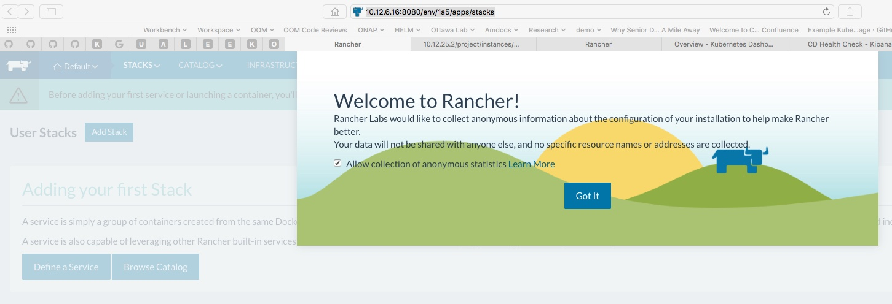

Add Kubernetes Environment to Rancher
-------------------------------------

1. Select “Manage Environments”

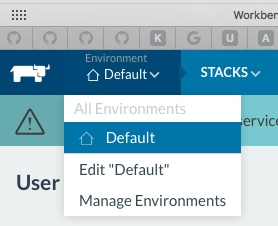

2. Select “Add Environment”

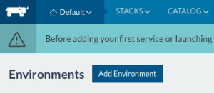

3. Add unique name for your new Rancher environment

4. Select the Kubernetes template

5. Click "create"

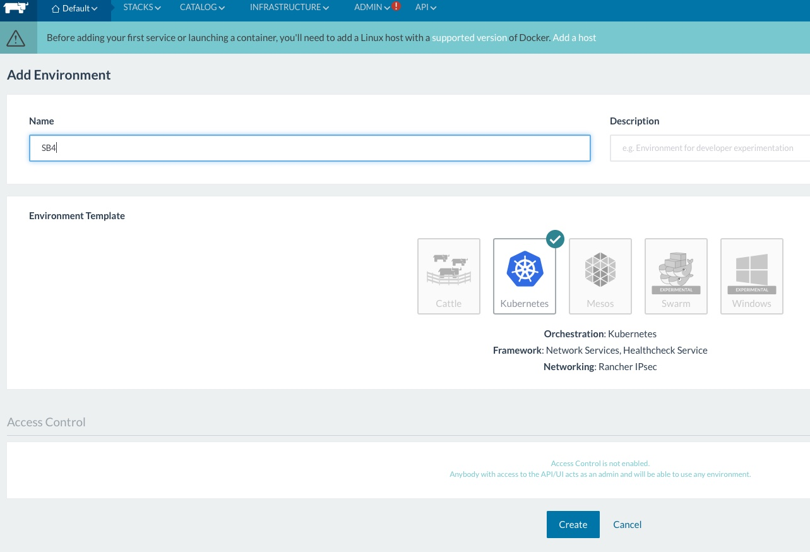

6. Select the new named environment (ie. SB4) from the dropdown list (top left).

Rancher is now waiting for a Kubernetes Host to be added.

Add Kubernetes Host
-------------------

1.  If this is the first (or only) host being added - click on the "Add a host" link

and click on "Save" (accept defaults).

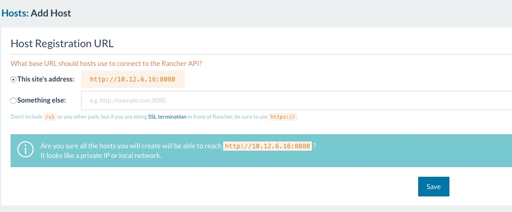

otherwise select INFRASTRUCTURE→ Hosts and click on "Add Host"

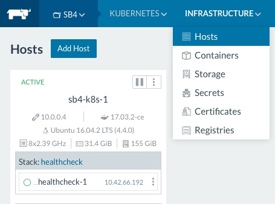

2. Enter the management IP for the k8s VM (e.g. 10.0.0.4) that was just created.

3. Click on “Copy to Clipboard” button

4. Click on “Close” button

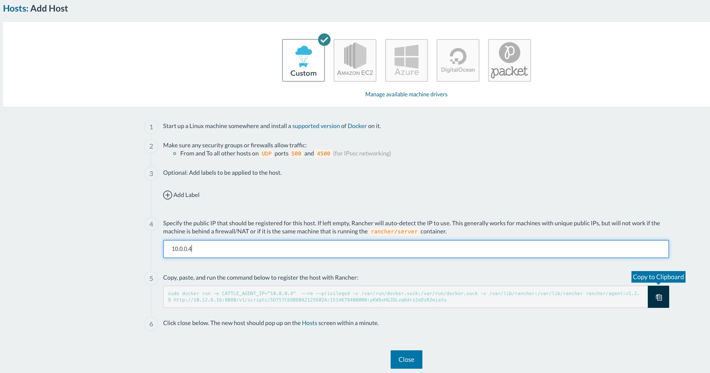

Without the 10.0.0.4 IP - the CATTLE_AGENT will be derived on the host - but it
may not be a routable IP.

Configure Kubernetes Host
-------------------------

1. Login to the new Kubernetes Host::

    > ssh -i ~/oom-key.pem ubuntu@10.12.5.1
    The authenticity of host '10.12.5.172 (10.12.5.172)' can't be established.
    ECDSA key fingerprint is SHA256:tqxayN58nCJKOJcWrEZzImkc0qKQHDDfUTHqk4WMcEI.
    Are you sure you want to continue connecting (yes/no)? yes
    Warning: Permanently added '10.12.5.172' (ECDSA) to the list of known hosts.
    Welcome to Ubuntu 16.04.2 LTS (GNU/Linux 4.4.0-64-generic x86_64)

     * Documentation: https://help.ubuntu.com
     * Management: https://landscape.canonical.com
     * Support: https://ubuntu.com/advantage

     Get cloud support with Ubuntu Advantage Cloud Guest:
       http://www.ubuntu.com/business/services/cloud

    180 packages can be updated.
    100 updates are security updates.

    The programs included with the Ubuntu system are free software;
    the exact distribution terms for each program are described in the
    individual files in /usr/share/doc/*/copyright.

    Ubuntu comes with ABSOLUTELY NO WARRANTY, to the extent permitted by
    applicable law.

    To run a command as administrator (user "root"), use "sudo <command>".
    See "man sudo_root" for details.

    ubuntu@sb4-k8s-1:~$

2. Paste Clipboard content and hit enter to install Rancher Agent::

    ubuntu@sb4-k8s-1:~$ sudo docker run -e CATTLE_AGENT_IP="10.0.0.4“ --rm --privileged -v /var/run/docker.sock:/var/run/docker.sock -v /var/lib/rancher:/var/lib/rancher rancher/agent:v1.2.9 http://10.12.6.16:8080/v1/scripts/5D757C68BD0A2125602A:1514678400000:yKW9xHGJDLvq6drz2eDzR2mjato
    Unable to find image 'rancher/agent:v1.2.9' locally
    v1.2.9: Pulling From rancher/agent
    b3e1c725a85f: Pull complete
    6071086409fc: Pull complete
    d0ac3b234321: Pull complete
    87f567b5cf58: Pull complete
    a63e24b217c4: Pull complete
    d0a3f58caef0: Pull complete
    16914729cfd3: Pull complete
    dc5c21984c5b: Pull complete
    d7e8f9784b20: Pull complete
    Digest: sha256:c21255ac4d94ffbc7b523F870F20ea5189b68Fa3d642800adb4774aab4748e66
    Status: Downloaded newer image for rancher/agent:v1.2.9

    INFO: Running Agent Registration Process, CATTLE_URL=http://10.12.6.16:8080/v1
    INFO: Attempting to connect to: http://10.12.6.16:8080/v1
    INFO: http://10.12.6.16:8080/v1 is accessible
    INFO: Inspecting host capabilities
    INFO: Boot2Docker: false
    INFO: Host writable: true
    INFO: Token: xxxxxxxx
    INFO: Running registration
    INFO: Printing Environment
    INFO: ENV: CATTLE_ACCESS_KEY=98B35AC484FBF820E0AD
    INFO: ENV: CATTLE_AGENT_IP=10.0.9.4
    INFO: ENV: CATTLE_HOME=/var/lib/cattle
    INFO: ENV: CATTLE_REGISTRATION_ACCESS_KEY=registrationToken
    INFO: ENV: CATTLE_REGISTRATION_SECRET_KEY=xxxxxxx
    INFO: ENV: CATTLE_SECRET_KEY=xxxxxxx
    INFO: ENV: CATTLE_URL=http://10.12.6.16:8080/v1
    INFO: ENV: DETECTED_CATTLE_AGENT_IP=10.12.5.172
    INFO: ENV: RANCHER_AGENT_IMAGE=rancher/agent:v1.2.9
    INFO: Launched Rancher Agent: c27ee0f3dc4c783b0db647ea1f73c35b3843a4b8d60b96375b1a05aa77d83136
    ubuntu@sb4-k8s-1:~$

3. Return to Rancher environment (e.g. SB4) and wait for services to complete
   (~ 10-15 mins)

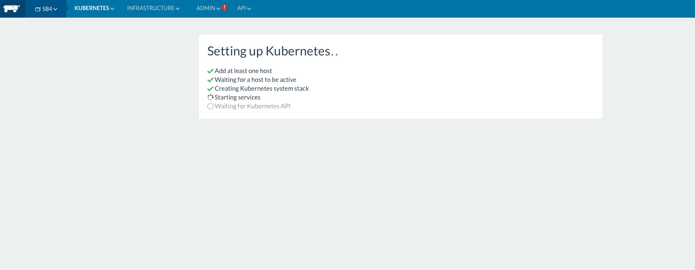

Configure kubectl and helm
==========================
In this example we are configuring kubectl and helm that have been installed
(as a convenience) onto the rancher and kubernetes hosts.  Typically you would
install them both on your PC and remotely connect to the cluster. The following
procedure would remain the same.

1. Click on CLI and then click on “Generate Config”

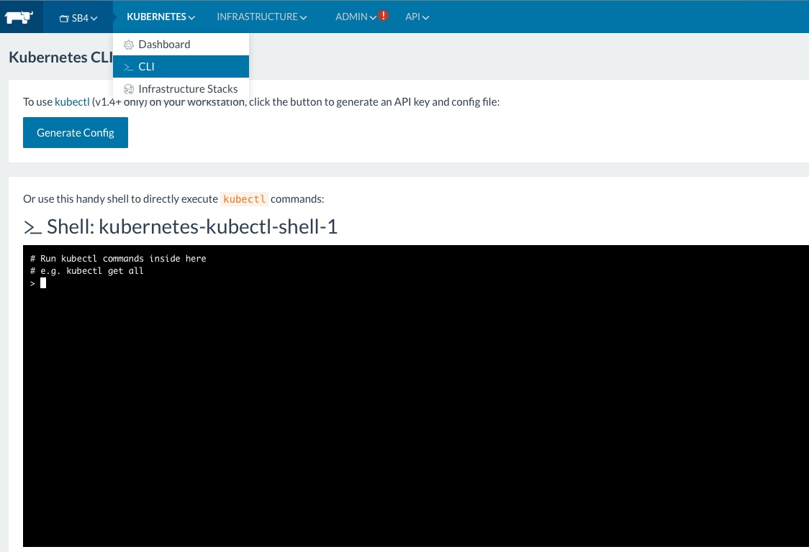

2. Click on “Copy to Clipboard” - wait until you see a "token" - do not copy
   user+password - the server is not ready at that point

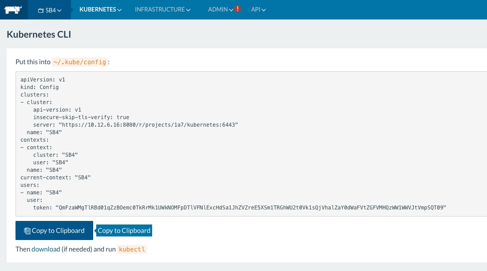

3. Create a .kube directory in user directory (if one does not exist)::

    ubuntu@sb4-kSs-1:~$ mkdir .kube
    ubuntu@sb4-kSs-1:~$ vi .kube/config

4. Paste contents of Clipboard into a file called “config” and save the file::

    apiVersion: v1
    kind : Config
    clusters:
    - cluster:
        api-version: v1
        insecure-skip-tls-verify: true
        server: "https://10.12.6.16:8080/r/projects/1a7/kubernetes:6443"
      name: "SB4"
    contexts:
    - context:
        cluster: "SB4"
        user: "SB4"
      name: "SB4"
    current-context: "SB4"
    users:
    - name: "SB4"
      user:
        token: "QmFzaWMgTlRBd01qZzBOemc)TkRrMk1UWkNOMFpDTlVFNlExcHdSa1JhVZreE5XSm1TRGhWU2t0Vk1sQjVhalZaY0dWaFVtZGFVMHQzWW1WWVJtVmpSQT09"
    ~
    ~
    ~
    - INSERT --

5. Validate that kubectl is able to connect to the kubernetes cluster::

    ubuntu@sb4-k8s-1:~$ kubectl config get-contexts
    CURRENT   NAME   CLUSTER   AUTHINFO   NAMESPACE
    *         SB4    SB4       SB4
    ubuntu@sb4-kSs-1:~$

and show running pods::

    ubuntu@sb4-k8s-1:~$ kubectl get pods --all-namespaces -o=wide
    NAMESPACE    NAME                                  READY   STATUS    RESTARTS   AGE   IP             NODE
    kube-system  heapster—7Gb8cd7b5 -q7p42             1/1     Running   0          13m   10.42.213.49   sb4-k8s-1
    kube-system  kube-dns-5d7bM87c9-c6f67              3/3     Running   0          13m   10.42.181.110  sb4-k8s-1
    kube-system  kubernetes-dashboard-f9577fffd-kswjg  1/1     Running   0          13m   10.42.105.113  sb4-k8s-1
    kube-system  monitoring-grafana-997796fcf-vg9h9    1/1     Running   0          13m   10.42,141.58   sb4-k8s-1
    kube-system  monitoring-influxdb-56chd96b-hk66b    1/1     Running   0          13m   10.4Z.246.90   sb4-k8s-1
    kube-system  tiller-deploy-cc96d4f6b-v29k9         1/1     Running   0          13m   10.42.147.248  sb4-k8s-1
    ubuntu@sb4-k8s-1:~$

6. Validate helm is running at the right version. If not, an error like this
   will be displayed::

    ubuntu@sb4-k8s-1:~$ helm list
    Error: incompatible versions c1ient[v2.8.2] server[v2.6.1]
    ubuntu@sb4-k8s-1:~$

7. Upgrade the server-side component of helm (tiller) via `helm init --upgrade`::

    ubuntu@sb4-k8s-1:~$ helm init --upgrade
    Creating /home/ubuntu/.helm
    Creating /home/ubuntu/.helm/repository
    Creating /home/ubuntu/.helm/repository/cache
    Creating /home/ubuntu/.helm/repository/local
    Creating /home/ubuntu/.helm/plugins
    Creating /home/ubuntu/.helm/starters
    Creating /home/ubuntu/.helm/cache/archive
    Creating /home/ubuntu/.helm/repository/repositories.yaml
    Adding stable repo with URL: https://kubernetes-charts.storage.googleapis.com
    Adding local repo with URL: http://127.0.0.1:8879/charts
    $HELM_HOME has been configured at /home/ubuntu/.helm.

    Tiller (the Helm server-side component) has been upgraded to the current version.
    Happy Helming!
    ubuntu@sb4-k8s-1:~$

ONAP Deployment via OOM
=======================
Now that kubernetes and Helm are installed and configured you can prepare to
deploy ONAP. Follow the instructions in the README.md_ or look at the official
documentation to get started:

- :ref:`quick-start-label` - deploy ONAP on an existing cloud
- :ref:`user-guide-label` - a guide for operators of an ONAP instance

