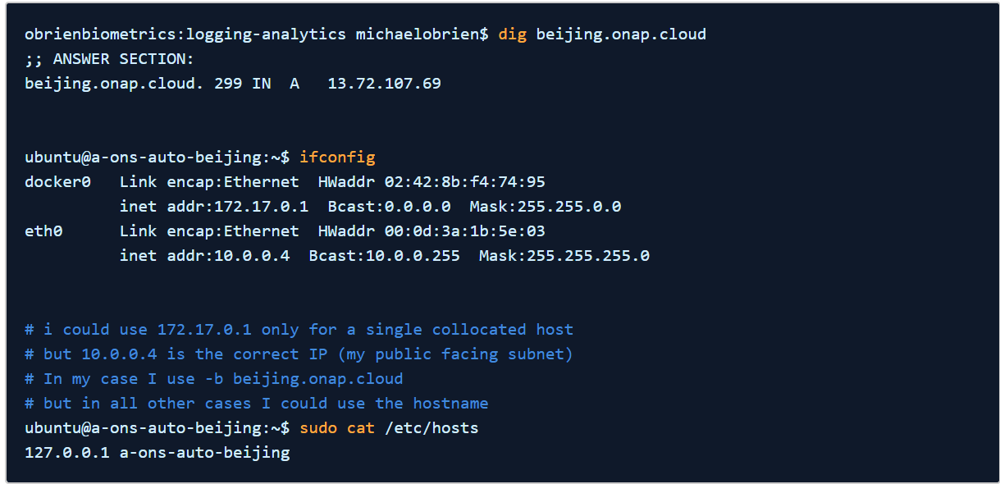
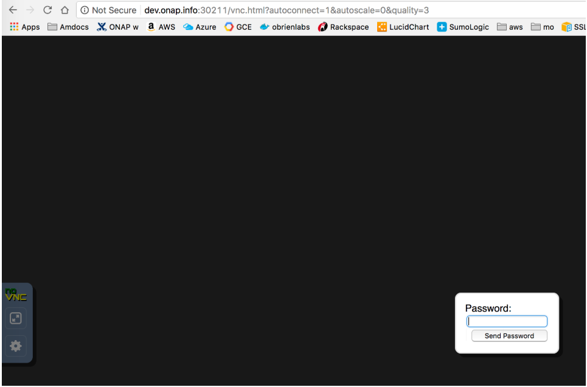
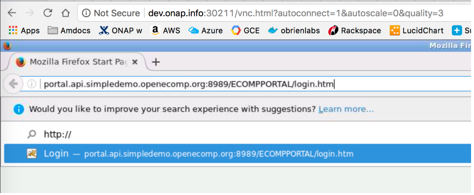
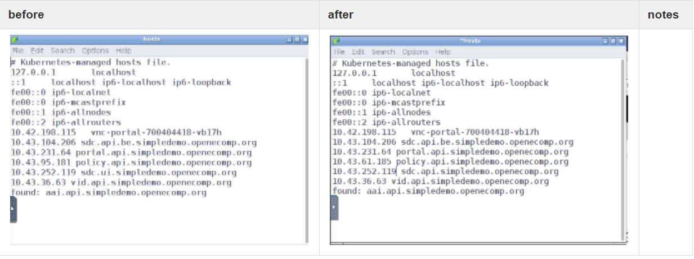
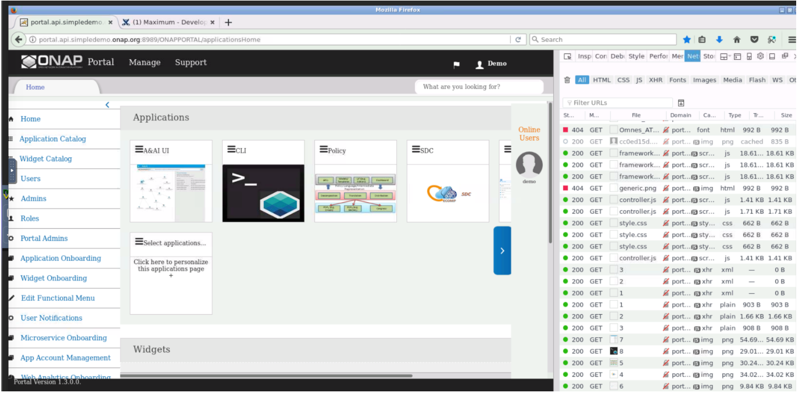

.. This work is licensed under a Creative Commons Attribution 4.0 International License.
.. http://creativecommons.org/licenses/by/4.0
.. Copyright 2018 Amdocs, Bell Canada

.. Links
.. _HELM Best Practices Guide: https://docs.helm.sh/chart_best_practices/#requirements
.. _kubectl Cheat Sheet: https://kubernetes.io/docs/reference/kubectl/cheatsheet/
.. _Kubernetes documentation for emptyDir: https://kubernetes.io/docs/concepts/storage/volumes/#emptydir
.. _Docker DevOps: https://wiki.onap.org/display/DW/Docker+DevOps#DockerDevOps-DockerBuild
.. _http://cd.onap.info:30223/mso/logging/debug: http://cd.onap.info:30223/mso/logging/debug
.. _Onboarding and Distributing a Vendor Software Product: https://wiki.onap.org/pages/viewpage.action?pageId=1018474

.. figure:: oomLogoV2-medium.png
   :align: right

.. _setup-kubernetes-rancher-label:

Setting up Kubernetes with Rancher
##################################

This page details the Rancher RI installation independent of the deployment target, such as Openstack, AWS, Azure, GCD, Bare-metal, and VMware.

This section comprises the following sub-sections:  

- Pre-requisites
- Rancher 1.6 Installation
- Config
- Rancher 2.0 Installation
- OOM ONAP Deployment Script
- HELM DevOps
- Kubernetes DevOps
- Troubleshooting

Pre-requisites
==============

The following table lists the supported versions for Rancher, Kubernetes, Helm, Kubectl, and Docker:

.. table:: Supported Versions

  ==============  ==========  ==========  =======  ========  =========
  Release         Rancher     Kubernetes  Helm     Kubectl   Docker
  ==============  ==========  ==========  =======  ========  =========
  Amsterdam       1.6.10      1.7.7       2.3.0    1.7.7     1.12.x
  Beijing         1.6.14      1.8.6       2.6.1+   1.8.6     17.03-ce
  ==============  ==========  ==========  =======  ========  =========
  
Rancher 1.6 Installation
========================

-Roger to update content for the Beijing release-

Execute the following procedure to install Rancher on clean Ubuntu 16.04 128g VM (single collocated server/host):

.. Note::
Amsterdam release requires a different onap-parameters.yaml.

.. code-block:: yaml

  Either
  git clone https://gerrit.onap.org/r/oom
  cd oom
  git pull https://gerrit.onap.org/r/oom refs/changes/19/32019/6
  cd install/rancher
  ./oom_rancher_setup.sh -b master -s 10.12.5.168 -e onap
  OR
  Run the WIP oom_entrypoint.sh script (And swap out your own onap-parameters.yaml)
  wget https://jira.onap.org/secure/attachment/LATEST_ID/oom_entrypoint.sh
  chmod 777 oom_entrypoint.sh
  ./oom_entrypoint.sh -b master -s 10.12.5.168 -e onap
  # refer to this script that runs oom_rancher_setup.sh and cd.sh in sequence
  # wait about 15 min to completion

Clone continuous deployment script - until it is merged (TBD)

.. code-block:: yaml

  wget https://jira.onap.org/secure/attachment/ID/cd.sh
  chmod 777 cd.sh
  wget https://jira.onap.org/secure/attachment/ID/aaiapisimpledemoopenecomporg.cer
  wget https://jira.onap.org/secure/attachment/1ID/onap-parameters.yaml
  wget https://jira.onap.org/secure/attachment/ID/aai-cloud-region-put.json
  ./cd.sh -b master -n onap
  # wait about 25-60 min depending on the speed of your network pulling docker images

Config
======

Rancher Host IP or FQDN
-----------------------

When running the oom_rancher_setup.sh script or manually installing rancher - which IP/FQDN to use (Need to rephrase the sentence here - Do we mean - This section describes which IP/FQDN to use for running the oom_rancher_setup.sh script or manually installing rancher).

JIRA link to include?

Edit the /etc/hosts file with a hostname linked to an IP address and use this name as the server.

If there is no response after pinging the IP address, use the ifconfig command and pick the non-docker IP address - Use the 172 docker IP in public facing subnets to work around the lockdown of the 10250 port in public for crypto miners. However, in a private subnet, use the real IP.

For example:

Rancher 2.0 Installation
========================
TBD: Execute the following procedure to install Rancher on clean Ubuntu 16.04 VM (single collocated server/host):
#. Set the hostname in /etc/hosts.
#. Execute the following script on a clean Ubuntu 16.04 VM -Roger please confirm if it is still valid for the Beijing release-:

.. code-block:: yaml

  ./oom_rancher2_setup.sh -s amsterdam.onap.info

Executing this script creates and registers the cluster. Now:

#. Log on to port 80 and wait for the cluster to appear Green in color.
#. Click the kubectl button.
#. Copy paste the contents to ~/.kube/config

The following output displays upon successful installation:

.. code-block:: yaml

  root@ip-172-31-84-230:~# docker ps
  CONTAINER ID        IMAGE                                                                                                                   COMMAND                  CREATED             STATUS              PORTS                                      NAMES
  66e823e8ebb8        gcr.io/google_containers/defaultbackend@sha256:865b0c35e6da393b8e80b7e3799f777572399a4cff047eb02a81fa6e7a48ed4b         "/server"                3 minutes ago       Up 3 minutes                                                   k8s_default-http-backend_default-http-backend-66b447d9cf-t4qxx_ingress-nginx_54afe3f8-1455-11e8-b142-169c5ae1104e_0
  7c9a6eeeb557        rancher/k8s-dns-sidecar-amd64@sha256:4581bf85bd1acf6120256bb5923ec209c0a8cfb0cbe68e2c2397b30a30f3d98c                   "/sidecar --v=2 --..."   3 minutes ago       Up 3 minutes                                                   k8s_sidecar_kube-dns-6f7666d48c-9zmtf_kube-system_51b35ec8-1455-11e8-b142-169c5ae1104e_0
  72487327e65b        rancher/pause-amd64:3.0                                                                                                 "/pause"                 3 minutes ago       Up 3 minutes                                                   k8s_POD_default-http-backend-66b447d9cf-t4qxx_ingress-nginx_54afe3f8-1455-11e8-b142-169c5ae1104e_0
  d824193e7404        rancher/k8s-dns-dnsmasq-nanny-amd64@sha256:bd1764fed413eea950842c951f266fae84723c0894d402a3c86f56cc89124b1d             "/dnsmasq-nanny -v..."   3 minutes ago       Up 3 minutes                                                   k8s_dnsmasq_kube-dns-6f7666d48c-9zmtf_kube-system_51b35ec8-1455-11e8-b142-169c5ae1104e_0
  89bdd61a99a3        rancher/k8s-dns-kube-dns-amd64@sha256:9c7906c0222ad6541d24a18a0faf3b920ddf66136f45acd2788e1a2612e62331                  "/kube-dns --domai..."   3 minutes ago       Up 3 minutes                                                   k8s_kubedns_kube-dns-6f7666d48c-9zmtf_kube-system_51b35ec8-1455-11e8-b142-169c5ae1104e_0
  7c17fc57aef9        rancher/cluster-proportional-autoscaler-amd64@sha256:77d2544c9dfcdfcf23fa2fcf4351b43bf3a124c54f2da1f7d611ac54669e3336   "/cluster-proporti..."   3 minutes ago       Up 3 minutes                                                   k8s_autoscaler_kube-dns-autoscaler-54fd4c549b-6bm5b_kube-system_51afa75f-1455-11e8-b142-169c5ae1104e_0
  024269154b8b        rancher/pause-amd64:3.0                                                                                                 "/pause"                 3 minutes ago       Up 3 minutes                                                   k8s_POD_kube-dns-6f7666d48c-9zmtf_kube-system_51b35ec8-1455-11e8-b142-169c5ae1104e_0
  48e039d15a90        rancher/pause-amd64:3.0                                                                                                 "/pause"                 3 minutes ago       Up 3 minutes                                                   k8s_POD_kube-dns-autoscaler-54fd4c549b-6bm5b_kube-system_51afa75f-1455-11e8-b142-169c5ae1104e_0
  13bec6fda756        rancher/pause-amd64:3.0                                                                                                 "/pause"                 3 minutes ago       Up 3 minutes                                                   k8s_POD_nginx-ingress-controller-vchhb_ingress-nginx_54aede27-1455-11e8-b142-169c5ae1104e_0
  332073b160c9        rancher/coreos-flannel-cni@sha256:3cf93562b936004cbe13ed7d22d1b13a273ac2b5092f87264eb77ac9c009e47f                      "/install-cni.sh"        3 minutes ago       Up 3 minutes                                                   k8s_install-cni_kube-flannel-jgx9x_kube-system_4fb9b39b-1455-11e8-b142-169c5ae1104e_0
  79ef0da922c5        rancher/coreos-flannel@sha256:93952a105b4576e8f09ab8c4e00483131b862c24180b0b7d342fb360bbe44f3d                          "/opt/bin/flanneld..."   3 minutes ago       Up 3 minutes                                                   k8s_kube-flannel_kube-flannel-jgx9x_kube-system_4fb9b39b-1455-11e8-b142-169c5ae1104e_0
  300eab7db4bc        rancher/pause-amd64:3.0                                                                                                 "/pause"                 3 minutes ago       Up 3 minutes                                                   k8s_POD_kube-flannel-jgx9x_kube-system_4fb9b39b-1455-11e8-b142-169c5ae1104e_0
  1597f8ba9087        rancher/k8s:v1.8.7-rancher1-1                                                                                           "/opt/rke/entrypoi..."   3 minutes ago       Up 3 minutes                                                   kube-proxy
  523034c75c0e        rancher/k8s:v1.8.7-rancher1-1                                                                                           "/opt/rke/entrypoi..."   4 minutes ago       Up 4 minutes                                                   kubelet
  788d572d313e        rancher/k8s:v1.8.7-rancher1-1                                                                                           "/opt/rke/entrypoi..."   4 minutes ago       Up 4 minutes                                                   scheduler
  9e520f4e5b01        rancher/k8s:v1.8.7-rancher1-1                                                                                           "/opt/rke/entrypoi..."   4 minutes ago       Up 4 minutes                                                   kube-controller
  29bdb59c9164        rancher/k8s:v1.8.7-rancher1-1                                                                                           "/opt/rke/entrypoi..."   4 minutes ago       Up 4 minutes                                                   kube-api
  2686cc1c904a        rancher/coreos-etcd:v3.0.17                                                                                             "/usr/local/bin/et..."   4 minutes ago       Up 4 minutes                                                   etcd
  a1fccc20c8e7        rancher/agent:v2.0.2                                                                                                    "run.sh --etcd --c..."   5 minutes ago       Up 5 minutes                                                   unruffled_pike
  6b01cf361a52        rancher/server:preview                                                                                                  "rancher --k8s-mod..."   5 minutes ago       Up 5 minutes        0.0.0.0:80->80/tcp, 0.0.0.0:443->443/tcp   rancher-server

OOM ONAP Deployment Script
==========================

Script or link to the script? -Roger to confirm-

HELM DevOps
===========

For information on HELM DevOps, refer to `HELM Best Practices Guide`_.

Kubernetes DevOps
=================
<TBD: overview> What does the following section describe?- Kubernetes configuration command? If yes, rename this section and delete the following sections.
Update the advance organizer above.

Kubernetes specific config
--------------------------

For information on Kubernetes specific configuration, see `kubectl Cheat Sheet`_.

**Deleting All Containers**

Execute the following command to delete all the containers and services:

.. code-block:: yaml

  ./deleteAll.bash -n onap -y
  # in amsterdam only
  ./deleteAll.bash -n onap

Delete/Rerun config-init container for /dockerdata-nfs refresh
--------------------------------------------------------------

TBD: refer to the procedure as part of https://github.com/obrienlabs/onap-root/blob/master/cd.sh
Delete the config-init container and its generated /dockerdata-nfs share. Note that pulling a new ONAP version requires new configuration to be deployed.
For example, it is observed that following files were available after a successful pull: 

.. code-block:: yaml

  root@ip-172-31-93-160:~/oom/kubernetes/oneclick# git pull

  Resolving deltas: 100% (135/135), completed with 24 local objects.

  From http://gerrit.onap.org/r/oom

  bf928c5..da59ee4  master     -> origin/master

  Updating bf928c5..da59ee4

  kubernetes/config/docker/init/src/config/aai/aai-config/cookbooks/aai-resources/aai-resources-auth/metadata.rb                                  |    7 +

  kubernetes/config/docker/init/src/config/aai/aai-config/cookbooks/aai-resources/aai-resources-auth/recipes/aai-resources-aai-keystore.rb        |    8 +

  kubernetes/config/docker/init/src/config/aai/aai-config/cookbooks/{ajsc-aai-config => aai-resources/aai-resources-config}/CHANGELOG.md          |    2 +-

  kubernetes/config/docker/init/src/config/aai/aai-config/cookbooks/{ajsc-aai-config => aai-resources/aai-resources-config}/README.md             |    4 +-                                                                                                  "rancher --k8s-mod..."   5 minutes ago       Up 5 minutes        0.0.0.0:80->80/tcp, 0.0.0.0:443->443/tcp   rancher-server

-Roger to confirm (should we include the JIRA link?)
  
.. code-block:: yaml

  # check for the pod
  kubectl get pods --all-namespaces -a
  # delete all the pod/services
  # master
  ./deleteAll.bash -n onap -y
  # amsterdam
  ./deleteAll.bash -n onap
  # delete the fs
  rm -rf /dockerdata-nfs/onap
  At this moment, its empty env
  #Pull the repo
  git pull
  # rerun the config
  cd ../config
  ./createConfig.bash -n onap
  If you get an error saying release onap-config is already exists then please run :- helm del --purge onap-config

  example 20170907
  root@kube0:~/oom/kubernetes/oneclick# rm -rf /dockerdata-nfs/
  root@kube0:~/oom/kubernetes/oneclick# cd ../config/
  root@kube0:~/oom/kubernetes/config# ./createConfig.sh -n onap
  **** Creating configuration for ONAP instance: onap
  Error from server (AlreadyExists): namespaces "onap" already exists
  Error: a release named "onap-config" already exists.
  Please run: helm ls --all "onap-config"; helm del --help
  **** Done ****
  root@kube0:~/oom/kubernetes/config# helm del --purge onap-config
  release "onap-config" deleted
  # rerun createAll.bash -n onap

Container Endpoint access
-------------------------

Check the services view in the Kuberntes API under robot
robot.onap-robot:88 TCP
robot.onap-robot:30209 TCP

.. code-block:: yaml

  kubectl get services --all-namespaces -o wide

  onap-vid      vid-mariadb            None           <none>        3306/TCP         1h        app=vid-mariadb
  
  onap-vid      vid-server             10.43.14.244   <nodes>       8080:30200/TCP   1h        app=vid-server

Container Logs
--------------

.. code-block:: yaml

  kubectl --namespace onap-vid logs -f vid-server-248645937-8tt6p

  16-Jul-2017 02:46:48.707 INFO [main] org.apache.catalina.startup.Catalina.start Server startup in 22520 ms

  kubectl --namespace onap-portal logs portalapps-2799319019-22mzl -f

  root@obriensystemskub0:~/oom/kubernetes/oneclick# kubectl get pods --all-namespaces -o wide

  NAMESPACE     NAME                                    READY     STATUS    RESTARTS   AGE       IP              NODE

  onap-robot    robot-44708506-dgv8j                    1/1       Running   0          36m       10.42.240.80    obriensystemskub0

  root@obriensystemskub0:~/oom/kubernetes/oneclick# kubectl --namespace onap-robot logs -f robot-44708506-dgv8j

  2017-07-16 01:55:54: (log.c.164) server started

A pod can be setup to log to a volume which can be inspected outside of a container. <TBD: how do you find the backing directory?>If you are unable to connect to the container you could inspect the backing volume instead.  This is how you find the backing directory for a pod which is using a volume which is an empty directory type, the log files can be found on the kubernetes node hosting the pod.  For more details, see `Kubernetes documentation for emptyDir`_.

Following is an example to find SDNC logs on a VM, hosting a kubernetes node.

.. code-block:: yaml

  #find the sdnc pod name and which kubernetes node its running on.   
  kubectl -n onap-sdnc get all -o wide
  #describe the pod to see the empty dir volume names and the pod uid
  kubectl -n onap-sdnc describe po/sdnc-5b5b7bf89c-97qkx
  #ssh to the VM hosting the kubernetes node if you are not alredy on the vm 
  ssh  root@vm-host
  #search the /var/lib/kubelet/pods/ directory for the log file
  sudo find /var/lib/kubelet/pods/ | grep sdnc-logs
  #The result is path that has the format /var/lib/kubelet/pods/<pod-uid>/volumes/kubernetes.io~empty-dir/<volume-name>
  
  /var/lib/kubelet/pods/d6041229-d614-11e7-9516-fa163e6ff8e8/volumes/kubernetes.io~empty-dir/sdnc-logs
  /var/lib/kubelet/pods/d6041229-d614-11e7-9516-fa163e6ff8e8/volumes/kubernetes.io~empty-dir/sdnc-logs/sdnc
  /var/lib/kubelet/pods/d6041229-d614-11e7-9516-fa163e6ff8e8/volumes/kubernetes.io~empty-dir/sdnc-logs/sdnc/karaf.log
  /var/lib/kubelet/pods/d6041229-d614-11e7-9516-fa163e6ff8e8/plugins/kubernetes.io~empty-dir/sdnc-logs
  /var/lib/kubelet/pods/d6041229-d614-11e7-9516-fa163e6ff8e8/plugins/kubernetes.io~empty-dir/sdnc-logs/ready

Robot Logs
----------

.. code-block:: yaml

 Logs in OOM Kubernetes with a robot:robot auth

  http://<your_dns_name>:30209/logs/demo/InitDistribution/report.html
  
  for example after a
  
  oom/kubernetes/robot$./demo-k8s.sh distribute
  
  find your path to the logs by using for example
  
  root@ip-172-31-57-55:/dockerdata-nfs/onap/robot# kubectl --namespace onap-robot exec -it robot-4251390084-lmdbb bash
  
  root@robot-4251390084-lmdbb:/# ls /var/opt/OpenECOMP_ETE/html/logs/demo/InitD                                                            
  
  InitDemo/         InitDistribution/ 
  
  path is
  
  http://<your_dns_name>:30209/logs/demo/InitDemo/log.html#s1-s1-s1-s1-t1

SSH into ONAP containers
------------------------

TBD (there is a link mentioned in Wiki here. Should we include that here?)

.. code-block:: yaml

  Get the pod name using:

  kubectl get pods --all-namespaces -o wide

  bash into the pod using:

  kubectl -n onap-mso exec -it  mso-1648770403-8hwcf /bin/bash

Push Files to Pods
------------------

To get an authorization file into the robot pod

.. code-block:: yaml

  root@obriensystemskub0:~/oom/kubernetes/oneclick# kubectl cp authorization onap-robot/robot-44708506-nhm0n:/home/ubuntu

  above works? <TBD>
  root@obriensystemskub0:~/oom/kubernetes/oneclick# kubectl cp authorization onap-robot/robot-44708506-nhm0n:/etc/lighttpd/authorization
  tar: authorization: Cannot open: File exists
  tar: Exiting with failure status due to previous errors

Redeploying Code war/jar in a docker container
----------------------------------------------

See building the docker image - use your own local repo or a repo on dockerhub - modify the values.yaml and delete/create your pod to switch images

For more information, refer to `Docker DevOps`_.

Turn on Debugging
-----------------

Use the following URL to turn on debugging:
`http://cd.onap.info:30223/mso/logging/debug`_

OR you can also turn on debugging using the logback.xml file.

Attaching a debugger to a docker container
------------------------------------------

TODO - placeholder is created in WIki as of now.

Running ONAP Portal UI Operations
---------------------------------

<TBD: what does the following section describe? UI operations required to access the ONAP platform> 

**Running ONAP using the vnc-portal**

Refer to the `Onboarding and Distributing a Vendor Software Product`_ Tutorial

or run the vnc-portal container to access ONAP using the traditional port mappings.

Check for the vnc-portal port using (Default: 30211):

.. code-block:: yaml

  obrienbiometrics:onap michaelobrien$ ssh ubuntu@dev.onap.info
  ubuntu@ip-172-31-93-122:~$ sudo su -
  root@ip-172-31-93-122:~# kubectl get services --all-namespaces -o wide
  NAMESPACE             NAME         CLUSTER-IP      EXTERNAL-IP   PORT(S)                          AGE       SELECTOR
  onap-portal           vnc-portal   10.43.78.204    <nodes>       6080:30211/TCP,5900:30212/TCP    4d        app=vnc-portal

Step 1. Launch the vnc-portal in a browser.

   http://dev.onap.info:30211/

   Enter "password" as the passowrd.

Step 2. Open firefox inside the VNC vm - launch portal normally

   http://portal.api.simpledemo.onap.org:8989/ONAPPORTAL/login.htm

Step 3. Before running SDC, Modify the value 'sdc.ui' to 'sdc.api' in the /etc/hosts file, as depicted in the following figure:

Step 4. Logon to ONAP Portal and run the SDC application.

Continue with the normal ONAP demo flow described at `Onboarding and Distributing a Vendor Software Product`_ Tutorial.

Running Multiple ONAP namespaces
--------------------------------

TODO

Troubleshooting
===============
  
Rancher fails to restart on server reboot
-----------------------------------------

The issue is encountered after a reboot of a colocated server/agent.

Installing Clean Ubuntu
-----------------------

.. code-block:: yaml

  apt-get install ssh
  apt-get install ubuntu-desktop
  
DNS Resolution
--------------

ignore - not relevant (as mentioned in Wiki - please confirm?)

Search Line limits were exceeded, some dns names have been omitted, the applied search line is: default.svc.cluster.local svc.cluster.local cluster.local kubelet.kubernetes.rancher.internal kubernetes.rancher.internal rancher.internal

**Config Pod fails to start with Error**

Make sure your Openstack parameters are set if you get the following starting up the config pod:

.. code-block:: yaml

  root@obriensystemsu0:~# kubectl get pods --all-namespaces -a
  NAMESPACE     NAME                                   READY     STATUS    RESTARTS   AGE
  kube-system   heapster-4285517626-l9wjp              1/1       Running   4          22d
  kube-system   kube-dns-2514474280-4411x              3/3       Running   9          22d
  kube-system   kubernetes-dashboard-716739405-fq507   1/1       Running   4          22d
  kube-system   monitoring-grafana-3552275057-w3xml    1/1       Running   4          22d
  kube-system   monitoring-influxdb-4110454889-bwqgm   1/1       Running   4          22d
  kube-system   tiller-deploy-737598192-841l1          1/1       Running   4          22d
  onap          config                                 0/1       Error     0          1d
  root@obriensystemsu0:~# vi /etc/hosts
  root@obriensystemsu0:~# kubectl logs -n onap config
  Validating onap-parameters.yaml has been populated
  Error: OPENSTACK_UBUNTU_14_IMAGE must be set in onap-parameters.yaml
  + echo 'Validating onap-parameters.yaml has been populated'
  + [[ -z '' ]]
  + echo 'Error: OPENSTACK_UBUNTU_14_IMAGE must be set in onap-parameters.yaml'
  + exit 1

  fix
  root@obriensystemsu0:~/onap_1007/oom/kubernetes/config# helm delete --purge onap-config
  release "onap-config" deleted
  root@obriensystemsu0:~/onap_1007/oom/kubernetes/config# ./createConfig.sh -n onap

  **** Creating configuration for ONAP instance: onap
  Error from server (AlreadyExists): namespaces "onap" already exists
  NAME:   onap-config
  LAST DEPLOYED: Mon Oct  9 21:35:27 2017
  NAMESPACE: onap
  STATUS: DEPLOYED

  RESOURCES:
  ==> v1/ConfigMap
  NAME                   DATA  AGE
  global-onap-configmap  15    0s

  ==> v1/Pod
  NAME    READY  STATUS             RESTARTS  AGE
  config  0/1    ContainerCreating  0         0s

  **** Done ****
  root@obriensystemsu0:~/onap_1007/oom/kubernetes/config# kubectl get pods --all-namespaces -a
  NAMESPACE     NAME                                   READY     STATUS    RESTARTS   AGE
  kube-system   heapster-4285517626-l9wjp              1/1       Running   4          22d
  kube-system   kube-dns-2514474280-4411x              3/3       Running   9          22d
  kube-system   kubernetes-dashboard-716739405-fq507   1/1       Running   4          22d
  kube-system   monitoring-grafana-3552275057-w3xml    1/1       Running   4          22d
  kube-system   monitoring-influxdb-4110454889-bwqgm   1/1       Running   4          22d
  kube-system   tiller-deploy-737598192-841l1          1/1       Running   4          22d
  onap          config                                 1/1       Running   0          25s
  root@obriensystemsu0:~/onap_1007/oom/kubernetes/config# kubectl get pods --all-namespaces -a
  NAMESPACE     NAME                                   READY     STATUS      RESTARTS   AGE
  kube-system   heapster-4285517626-l9wjp              1/1       Running     4          22d
  kube-system   kube-dns-2514474280-4411x              3/3       Running     9          22d
  kube-system   kubernetes-dashboard-716739405-fq507   1/1       Running     4          22d
  kube-system   monitoring-grafana-3552275057-w3xml    1/1       Running     4          22d
  kube-system   monitoring-influxdb-4110454889-bwqgm   1/1       Running     4          22d
  kube-system   tiller-deploy-737598192-841l1          1/1       Running     4          22d
  onap          config                                 0/1       Completed   0          1m

