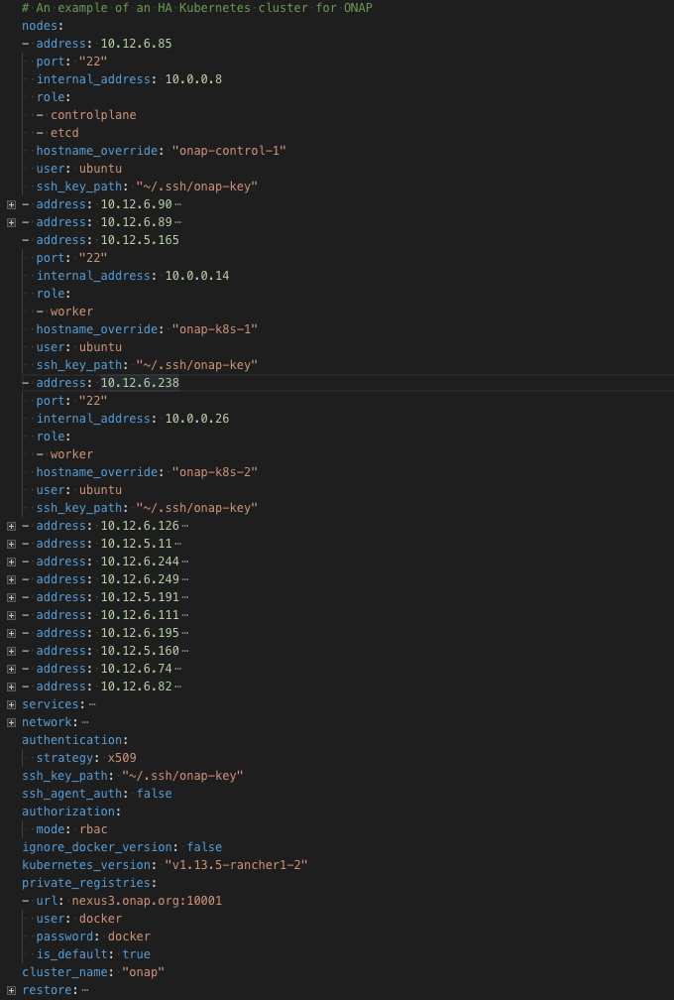

.. This work is licensed under a Creative Commons Attribution 4.0 International License.
.. http://creativecommons.org/licenses/by/4.0
.. Copyright 2018 Amdocs, Bell Canada

.. Links
.. _HELM Best Practices Guide: https://docs.helm.sh/chart_best_practices/#requirements
.. _kubectl Cheat Sheet: https://kubernetes.io/docs/reference/kubectl/cheatsheet/
.. _Kubernetes documentation for emptyDir: https://kubernetes.io/docs/concepts/storage/volumes/#emptydir
.. _Docker DevOps: https://wiki.onap.org/display/DW/Docker+DevOps#DockerDevOps-DockerBuild
.. _http://cd.onap.info:30223/mso/logging/debug: http://cd.onap.info:30223/mso/logging/debug
.. _Onboarding and Distributing a Vendor Software Product: https://wiki.onap.org/pages/viewpage.action?pageId=1018474
.. _README.md: https://gerrit.onap.org/r/gitweb?p=oom.git;a=blob;f=kubernetes/README.md

.. figure:: oomLogoV2-medium.png
   :align: right

.. _onap-on-kubernetes-with-rancher:

ONAP on HA Kubernetes Cluster
#############################

This guide provides instructions on how to setup a Highly-Available Kubernetes Cluster.
For this, we are hosting our cluster on OpenStack VMs and using the Rancher Kubernetes Engine (RKE)
to deploy and manage our Kubernetes Cluster.

The result at the end of this tutorial will be:

*1.* Creation of a Key Pair to use with Open Stack and RKE

*2.* Creation of OpenStack VMs to host Kubernetes Control Plane

*3.* Creation of OpenStack VMs to host Kubernetes Workers

*4.* Installation and configuration of RKE to setup an HA Kubernetes

*5.* Installation and configuration of kubectl

*5.* Installation and configuration of helm

*7.* Creation of an NFS Server to be used by ONAP as shared persistance

There are many ways one can execute the above steps. Including automation through the use of HEAT to setup the OpenStack VMs.
To better illustrate the steps involved, we have captured the manual creation of such an environment using the ONAP Wind River Open Lab.

.. Note::
 Some steps, such as creating OAM networks and security groups, have been omitted from the guide.

.. contents::
   :depth: 1
   :local:
..

Create Key Pair
===============
A Key Pair is required to access the created OpenStack VMs and will be used by
RKE to configure the VMs for Kubernetes.

Use an existing key pair, import one or create a new one to assign.

.. image:: images/keys/key_pair_1.png

.. Note::
  If you're creating a new Key Pair, ensure to create a local copy of the Private Key through the use of "Copy Private Key to Clipboard".

For the purpose of this guide, we will assume a new local key called "onap-key"
has been downloaded and is copied into **~/.ssh/**, from which it can be referenced.

Example:
  > mv onap-key ~/.ssh
  > chmod 600 ~/.ssh/onap-key

Create Kubernetes Control Plane VMs
===================================

The following instructions describe how to create 3 OpenStack VMs to host the
Highly-Available Kubernetes Control Plane.
ONAP workloads will not be scheduled on this Control Plane nodes.

Launch new VM instances
-----------------------

.. image:: images/cp_vms/control_plane_1.png

Select Ubuntu 18.04 as base image
---------------------------------
Select "No" on "Create New Volume"

.. image:: images/cp_vms/control_plane_2.png

Select Flavor
-------------
The recommended flavor is at least 4 vCPU and 8GB ram.

.. image:: images/cp_vms/control_plane_3.png

Networking
----------

.. image:: images/cp_vms/control_plane_4.png

Security Groups
---------------

.. image:: images/cp_vms/control_plane_5.png

Key Pair
--------
Assign the key pair that was created/selected previously (e.g. onap_key).

.. image:: images/cp_vms/control_plane_6.png

Apply customization script for Control Plane VMs
------------------------------------------------

Click :download:`openstack-k8s-controlnode.sh <openstack-k8s-controlnode.sh>` to download the
script.

.. literalinclude:: openstack-k8s-controlnode.sh
   :language: bash

This customization script will:

* update ubuntu
* install docker

.. image:: images/cp_vms/control_plane_7.png

Launch Instance
---------------

.. image:: images/cp_vms/control_plane_8.png

Create Kubernetes Worker VMs
============================
The following instructions describe how to create OpenStack VMs to host the
Highly-Available Kubernetes Workers. ONAP workloads will only be scheduled on these nodes.

Launch new VM instances
-----------------------

The number and size of Worker VMs is depenedent on the size of the ONAP deployment. 
By default, all ONAP applications will be deployed. It's possible to customize the deployment 
and enable/disable only those ONAP applications desired. For the purpose of this guide, however,
we will deploy 12 Kubernetes Workers that have been sized to handle an entire ONAP 
application workload.

.. image:: images/wk_vms/worker_1.png

Select Ubuntu 18.04 as base image
---------------------------------
Select "No" on "Create New Volume"

.. image:: images/wk_vms/worker_2.png

Select Flavor
-------------
The size of Kubernetes hosts depend on the size of the ONAP deployment that
will be installed.

If a small subset of ONAP applications are being deployed for testing purposes,
then a single 16GB or 32GB may be sufficient.

.. image:: images/wk_vms/worker_3.png

Networking
-----------

.. image:: images/wk_vms/worker_4.png

Security Group
---------------

.. image:: images/wk_vms/worker_5.png

Key Pair
--------
Assign the key pair that was created/selected previously (e.g. onap_key).

.. image:: images/wk_vms/worker_6.png

Apply customization script for Kubernetes VM(s)
-----------------------------------------------

Click :download:`openstack-k8s-workernode.sh <openstack-k8s-workernode.sh>` to download the
script.

.. literalinclude:: openstack-k8s-workernode.sh
   :language: bash

This customization script will:

* update ubuntu
* install docker
* install nfs common (see configuration step here)

Launch Instance
---------------

.. image:: images/wk_vms/worker_7.png

Assign Floating IP addresses
----------------------------
Repeat the assignment of Floating IPs to all Control Plane and Worker VMs.
These addresses provide external access to the VMs and will be used by RKE to configure
the VMs with kubernetes.

.. image:: images/floating_ips/floating_1.png

Resulting floating IP assignments in this example.

.. image:: images/floating_ips/floating_2.png

Configure Rancher Kubernetes Engine (RKE)
=========================================

Install RKE
-----------
Download and install RKE on a VM, your desktop or laptop.
Binaries can be found here for Linux and Mac:

https://github.com/rancher/rke/releases/tag/v0.2.1

The input into RKE is a *cluster.yml* file. This file describes a Kubernetes cluster
to map onto the OpenStack VMs that were created earlier in this guide.

Example: **cluster.yml**

Click :download:`cluster.yml <cluster.yml>` to download the
configuration file.

.. literalinclude:: cluster.yml
   :language: yaml

Prepare cluster.yml
-------------------
Before this configuration file can be used, however, the external **address**
and the **internal_address** must be mapped for each control and worker node
in this file.

Run RKE
-------
Once completed, from within the same directory as the cluster.yml file, simply do:

  > rke up

The output will look something like:

.. code-block::
  INFO[0000] Initiating Kubernetes cluster
  INFO[0000] [certificates] Generating admin certificates and kubeconfig
  INFO[0000] Successfully Deployed state file at [./cluster.rkestate]
  INFO[0000] Building Kubernetes cluster
  INFO[0000] [dialer] Setup tunnel for host [10.12.6.82]
  INFO[0000] [dialer] Setup tunnel for host [10.12.6.249]
  INFO[0000] [dialer] Setup tunnel for host [10.12.6.74]
  INFO[0000] [dialer] Setup tunnel for host [10.12.6.85]
  INFO[0000] [dialer] Setup tunnel for host [10.12.6.238]
  INFO[0000] [dialer] Setup tunnel for host [10.12.6.89]
  INFO[0000] [dialer] Setup tunnel for host [10.12.5.11]
  INFO[0000] [dialer] Setup tunnel for host [10.12.6.90]
  INFO[0000] [dialer] Setup tunnel for host [10.12.6.244]
  INFO[0000] [dialer] Setup tunnel for host [10.12.5.165]
  INFO[0000] [dialer] Setup tunnel for host [10.12.6.126]
  INFO[0000] [dialer] Setup tunnel for host [10.12.6.111]
  INFO[0000] [dialer] Setup tunnel for host [10.12.5.160]
  INFO[0000] [dialer] Setup tunnel for host [10.12.5.191]
  INFO[0000] [dialer] Setup tunnel for host [10.12.6.195]
  INFO[0002] [network] Deploying port listener containers
  INFO[0002] [network] Pulling image [nexus3.onap.org:10001/rancher/rke-tools:v0.1.27] on host [10.12.6.85]
  INFO[0002] [network] Pulling image [nexus3.onap.org:10001/rancher/rke-tools:v0.1.27] on host [10.12.6.89]
  INFO[0002] [network] Pulling image [nexus3.onap.org:10001/rancher/rke-tools:v0.1.27] on host [10.12.6.90]
  INFO[0011] [network] Successfully pulled image [nexus3.onap.org:10001/rancher/rke-tools:v0.1.27] on host [10.12.6.89]
  . . . .
  INFO[0309] [addons] Setting up Metrics Server
  INFO[0309] [addons] Saving ConfigMap for addon rke-metrics-addon to Kubernetes
  INFO[0309] [addons] Successfully saved ConfigMap for addon rke-metrics-addon to Kubernetes
  INFO[0309] [addons] Executing deploy job rke-metrics-addon
  INFO[0315] [addons] Metrics Server deployed successfully
  INFO[0315] [ingress] Setting up nginx ingress controller
  INFO[0315] [addons] Saving ConfigMap for addon rke-ingress-controller to Kubernetes
  INFO[0316] [addons] Successfully saved ConfigMap for addon rke-ingress-controller to Kubernetes
  INFO[0316] [addons] Executing deploy job rke-ingress-controller
  INFO[0322] [ingress] ingress controller nginx deployed successfully
  INFO[0322] [addons] Setting up user addons
  INFO[0322] [addons] no user addons defined
  INFO[0322] Finished building Kubernetes cluster successfully

Configure Kubectl
=================

Install kubectl
---------------
Download and install kubectl. Binaries can be found here for Linu and Mac:

https://storage.googleapis.com/kubernetes-release/release/v1.13.5/bin/linux/amd64/kubectl
https://storage.googleapis.com/kubernetes-release/release/v1.13.5/bin/darwin/amd64/kubectl

Copy RKE-generated kube config file to .kube directory
------------------------------------------------------
  > cp kube_config_cluster.yml ~/.kube/config.onap

  > export KUBECONFIG=~/.kube/config.onap

  > kubectl config use-context onap

  > kubectl get nodes -o=wide

.. code-block::
  NAME             STATUS   ROLES               AGE     VERSION   INTERNAL-IP   EXTERNAL-IP   OS-IMAGE           KERNEL-VERSION      CONTAINER-RUNTIME
  onap-control-1   Ready    controlplane,etcd   3h53m   v1.13.5   10.0.0.8      <none>        Ubuntu 18.04 LTS   4.15.0-22-generic   docker://18.9.5
  onap-control-2   Ready    controlplane,etcd   3h53m   v1.13.5   10.0.0.11     <none>        Ubuntu 18.04 LTS   4.15.0-22-generic   docker://18.9.5
  onap-control-3   Ready    controlplane,etcd   3h53m   v1.13.5   10.0.0.12     <none>        Ubuntu 18.04 LTS   4.15.0-22-generic   docker://18.9.5
  onap-k8s-1       Ready    worker              3h53m   v1.13.5   10.0.0.14     <none>        Ubuntu 18.04 LTS   4.15.0-22-generic   docker://18.9.5
  onap-k8s-10      Ready    worker              3h53m   v1.13.5   10.0.0.16     <none>        Ubuntu 18.04 LTS   4.15.0-22-generic   docker://18.9.5
  onap-k8s-11      Ready    worker              3h53m   v1.13.5   10.0.0.18     <none>        Ubuntu 18.04 LTS   4.15.0-22-generic   docker://18.9.5
  onap-k8s-12      Ready    worker              3h53m   v1.13.5   10.0.0.7      <none>        Ubuntu 18.04 LTS   4.15.0-22-generic   docker://18.9.5
  onap-k8s-2       Ready    worker              3h53m   v1.13.5   10.0.0.26     <none>        Ubuntu 18.04 LTS   4.15.0-22-generic   docker://18.9.5
  onap-k8s-3       Ready    worker              3h53m   v1.13.5   10.0.0.5      <none>        Ubuntu 18.04 LTS   4.15.0-22-generic   docker://18.9.5
  onap-k8s-4       Ready    worker              3h53m   v1.13.5   10.0.0.6      <none>        Ubuntu 18.04 LTS   4.15.0-22-generic   docker://18.9.5
  onap-k8s-5       Ready    worker              3h53m   v1.13.5   10.0.0.9      <none>        Ubuntu 18.04 LTS   4.15.0-22-generic   docker://18.9.5
  onap-k8s-6       Ready    worker              3h53m   v1.13.5   10.0.0.17     <none>        Ubuntu 18.04 LTS   4.15.0-22-generic   docker://18.9.5
  onap-k8s-7       Ready    worker              3h53m   v1.13.5   10.0.0.20     <none>        Ubuntu 18.04 LTS   4.15.0-22-generic   docker://18.9.5
  onap-k8s-8       Ready    worker              3h53m   v1.13.5   10.0.0.10     <none>        Ubuntu 18.04 LTS   4.15.0-22-generic   docker://18.9.5
  onap-k8s-9       Ready    worker              3h53m   v1.13.5   10.0.0.4      <none>        Ubuntu 18.04 LTS   4.15.0-22-generic   docker://18.9.5

Setting up an NFS share for Multinode Kubernetes Clusters
=========================================================
The figure below illustrates a possible topology of a multinode Kubernetes
cluster.

.. image:: k8s-topology.jpg

One node, the Master Node, runs Rancher and Helm clients and connects to all
the Kubernetes nodes in the cluster. Kubernetes nodes, in turn, run Rancher,
Kubernetes and Tiller (Helm) agents, which receive, execute, and respond to
commands issued by the Master Node (e.g. kubectl or helm operations). Note that
the Master Node can be either a remote machine that the user can log in to or a
local machine (e.g. laptop, desktop) that has access to the Kubernetes cluster.

Deploying applications to a Kubernetes cluster requires Kubernetes nodes to
share a common, distributed filesystem. One node in the cluster plays the role
of NFS Master (not to confuse with the Master Node that runs Rancher and Helm
clients, which is located outside the cluster), while all the other cluster
nodes play the role of NFS slaves. In the figure above, the left-most cluster
node plays the role of NFS Master (indicated by the crown symbol). To properly
set up an NFS share on Master and Slave nodes, the user can run the scripts
below.

Click :download:`master_nfs_node.sh <master_nfs_node.sh>` to download the
script.

.. literalinclude:: master_nfs_node.sh
   :language: bash

Click :download:`slave_nfs_node.sh <slave_nfs_node.sh>` to download the script.

.. literalinclude:: slave_nfs_node.sh
   :language: bash

The master_nfs_node.sh script runs in the NFS Master node and needs the list of
NFS Slave nodes as input, e.g.::

    > sudo ./master_nfs_node.sh node1_ip node2_ip ... nodeN_ip

The slave_nfs_node.sh script runs in each NFS Slave node and needs the IP of
the NFS Master node as input, e.g.::

    > sudo ./slave_nfs_node.sh master_node_ip

5. Validate that kubectl is able to connect to the kubernetes cluster::

    ubuntu@sb4-k8s-1:~$ kubectl config get-contexts
    CURRENT   NAME   CLUSTER   AUTHINFO   NAMESPACE
    *         SB4    SB4       SB4
    ubuntu@sb4-kSs-1:~$

and show running pods::

    ubuntu@sb4-k8s-1:~$ kubectl get pods --all-namespaces -o=wide
    NAMESPACE    NAME                                  READY   STATUS    RESTARTS   AGE   IP             NODE
    kube-system  heapster—7Gb8cd7b5 -q7p42             1/1     Running   0          13m   10.42.213.49   sb4-k8s-1
    kube-system  kube-dns-5d7bM87c9-c6f67              3/3     Running   0          13m   10.42.181.110  sb4-k8s-1
    kube-system  kubernetes-dashboard-f9577fffd-kswjg  1/1     Running   0          13m   10.42.105.113  sb4-k8s-1
    kube-system  monitoring-grafana-997796fcf-vg9h9    1/1     Running   0          13m   10.42,141.58   sb4-k8s-1
    kube-system  monitoring-influxdb-56chd96b-hk66b    1/1     Running   0          13m   10.4Z.246.90   sb4-k8s-1
    kube-system  tiller-deploy-cc96d4f6b-v29k9         1/1     Running   0          13m   10.42.147.248  sb4-k8s-1
    ubuntu@sb4-k8s-1:~$

6. Validate helm is running at the right version. If not, an error like this
   will be displayed::

    ubuntu@sb4-k8s-1:~$ helm list
    Error: incompatible versions c1ient[v2.9.1] server[v2.6.1]
    ubuntu@sb4-k8s-1:~$

7. Upgrade the server-side component of helm (tiller) via `helm init --upgrade`::

    ubuntu@sb4-k8s-1:~$ helm init --upgrade
    Creating /home/ubuntu/.helm
    Creating /home/ubuntu/.helm/repository
    Creating /home/ubuntu/.helm/repository/cache
    Creating /home/ubuntu/.helm/repository/local
    Creating /home/ubuntu/.helm/plugins
    Creating /home/ubuntu/.helm/starters
    Creating /home/ubuntu/.helm/cache/archive
    Creating /home/ubuntu/.helm/repository/repositories.yaml
    Adding stable repo with URL: https://kubernetes-charts.storage.googleapis.com
    Adding local repo with URL: http://127.0.0.1:8879/charts
    $HELM_HOME has been configured at /home/ubuntu/.helm.

    Tiller (the Helm server-side component) has been upgraded to the current version.
    Happy Helming!
    ubuntu@sb4-k8s-1:~$

ONAP Deployment via OOM
=======================
Now that kubernetes and Helm are installed and configured you can prepare to
deploy ONAP. Follow the instructions in the README.md_ or look at the official
documentation to get started:

- :ref:`quick-start-label` - deploy ONAP on an existing cloud
- :ref:`user-guide-label` - a guide for operators of an ONAP instance
