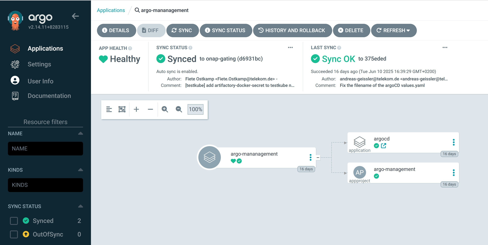
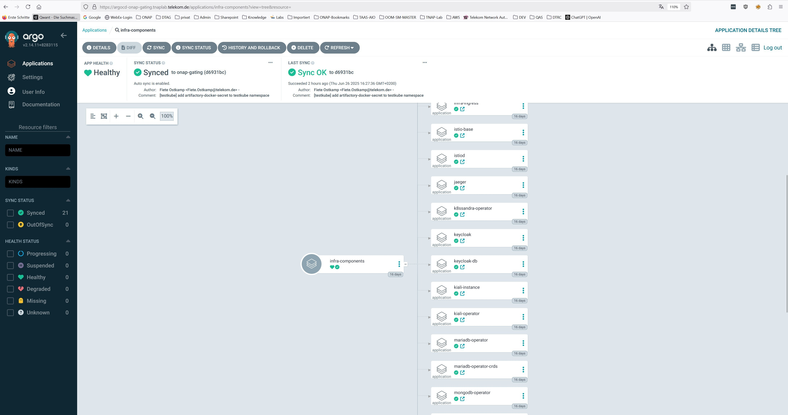
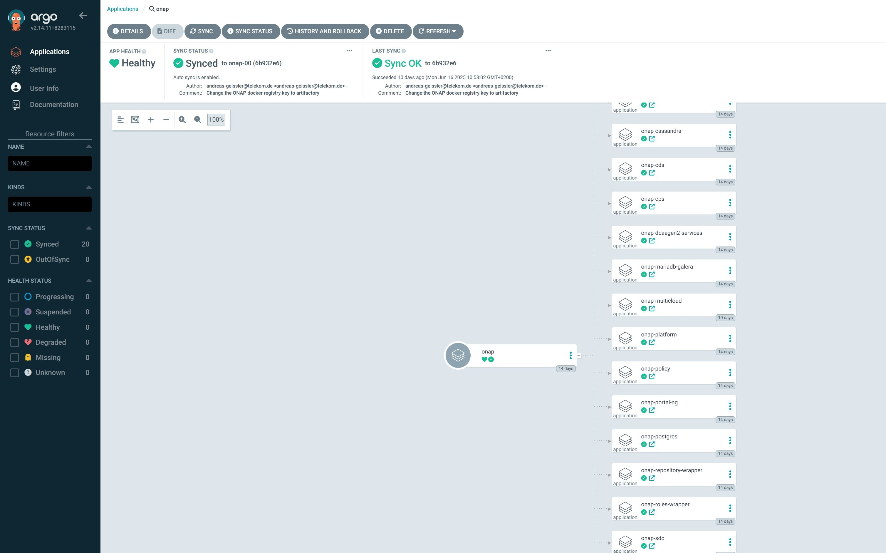

.. This work is licensed under a Creative Commons Attribution 4.0
.. International License.
.. http://creativecommons.org/licenses/by/4.0
.. Copyright (C) 2025 Deutsche Telekom

.. Links
.. _ONAP helm release repository: https://nexus3.onap.org/service/rest/repository/browse/onap-helm-release/
.. _ONAP Release Long Term Roadmap: https://lf-onap.atlassian.net/wiki/spaces/DW/pages/16220234/Long+Term+Release+Roadmap
.. _GitOps Deployment: https://www.cncf.io/blog/2025/06/09/gitops-in-2025-from-old-school-updates-to-the-modern-way/
.. _Trivy Scan: https://trivy.dev/latest/
.. _ArgoCD: https://argo-cd.readthedocs.io/en/stable/
.. _App of Apps: https://argo-cd.readthedocs.io/en/latest/operator-manual/cluster-bootstrapping/

.. _oom_argo_release_deploy:

OOM Deployment using ArgoCD
===========================

Besides the deployment of ONAP using helm as described in :ref:`oom_helm_release_repo_deploy`, you
can use GitOps based deployment of ONAP components using ArgoCD or Flux (see `GitOps deployment`_).
This document shows an example for an ArgoCD (see `ArgoCD`_) based installation.

General principles of GitOps and ArgoCD
---------------------------------------

GitOps is a modern approach to continuous delivery and infrastructure management
that uses Git as the source of truth for both application and infrastructure configurations.

In GitOps, all changes to the system, such as updates or rollbacks, are made through pull
requests in Git repositories, which then trigger automated deployment pipelines.

This ensures that the environment is always aligned with the desired state defined in the Git
repository, making the system more predictable and auditable.

ArgoCD is a Kubernetes-native continuous delivery tool that implements GitOps principles.
It monitors Git repositories for changes in configuration files
(such as YAML or Helm charts) and automatically syncs the state of the Kubernetes
clusters to match the desired configuration.
With ArgoCD, users can track application deployments and changes visually through
a web UI or CLI, providing transparency and easy rollback options.
It also supports multi-cluster deployments and offers strong access control mechanisms
to manage who can trigger changes.
The system is highly automated and allows for fast, secure delivery and operational
consistency across environments.

OOM support for ArgoCD deployment
---------------------------------

In the OOM repository a subtree is provided, which contains ArgoCD
Application definitions and other files supporting the installation
using ArgoCD:

An example structure of the OOM common helm charts is shown below:

.. code-block:: bash

  argo
  ├── argocd
  │   ├── app-argocd.yaml
  │   ├── kustomization.yaml
  │   ├── argo-project.yaml
  │   ├── argo-secret.yaml
  │   ├── argocd.yaml
  │   ├── values
  │   │   └── argocd.yaml
  ├── infra
  │   ├── app-infra.yaml
  │   ├── kustomization.yaml
  │   ├── certmanager.yaml
  │   ├── chartmuseum.yaml
  │   ├── compile-onap.yaml
  │   ├── ...
  │   ├── values
  │   │   ├── certmanager.yaml
  │   │   ├── chartmuseum.yaml
  │   │   ├── compile-onap.yaml
  │   │   ├── ...
  │   │   └── xxx.yaml
  │   ├── compile-onap
  │   │   └── helm
  │   │       ├── Chart.yaml
  │   │       ├── values.yaml
  │   │       └── templates
  │   │           └── onap-helm-render-job.yaml
  │   ├── ...
  ├── onap
  │   ├── app-onap.yaml
  │   ├── kustomization.yaml
  │   ├── a1policymanagement.yaml
  │   ├── aai.yaml
  │   ├── authentication.yaml
  │   ├── cds.yaml
  │   ├── ...
  │   ├── values
  │   │   ├── a1policymanagement.yaml
  │   │   ├── aai.yaml
  │   │   ├── authentication.yaml
  │   │   ├── ...
  │   │   └── xxx.yaml
  ├── onap-test
  │   ├── app-onap-test.yaml
  │   ├── kustomization.yaml
  │   ├── kafka-ui.yaml
  │   ├── onap-test-ingress.yaml
  │   ├── testkube.yaml
  │   ├── trivy-operator.yaml
  │   ├── values
  │   │   ├── kafka-ui.yaml
  │   │   ├── onap-test-ingress.yaml
  │   │   ├── testkube.yaml
  │   │   └── trivy-operator.yaml
  │   ├── ingress-routes
  │   │   └── helm
  │   │       ├── Chart.yaml
  │   │       ├── values.yaml
  │   │       └── templates
  │   │           └── ingress-kafka-ui.yaml
  │   ├── ...
  └── update-variables.sh

The main folders are:

* argocd

  * Application definition for the ArgoCD deployment

* infra

  * Application definitions for required infrastructure components
    (e.g. Istio, CertManager, DB Operators, ...)
  * Required Helm Charts for IngressRoutes, Kiali, ONAP Chart compilation

* onap

  * Application definitions for ONAP components (e.g. AAI, CDS, SO, ...)

* onap-test

  * Application definitions for ONAP Test components and tools
    (e.g. Trivy Scan, Testkube, Kafka-UI)

General hints and preparation
-----------------------------

Prerequisites
^^^^^^^^^^^^^

As prerequisite you would need a Kubernetes cluster with the required
capacity to deploy the components into.

The Infrastructure (e.g. Bare Metal servers, Virtual Hosts) and the
way of deployment  (e.g. ClusterAPI, Kubespray) is not restricted.

In the tests of the OOM team it is done:

* On a vanilla Openstack cluster
* Using Terraform to create the tenant, VMs and networking
* Using Kubespray to create the K8S cluster
* Use a GitLab-CI pipeline to orchestrate the creation

At the end of the deployment you need to install ArgoCD in this cluster
for the further process of installation.

As a input parameters for the ONAP deployment you would need to provide:

* A local Git(lab) project to store the "argo" Application definitions (or the oom project)
* Storage Class the cluster provides for PVs
* (Optional) A local helm registry to store the ONAP helmcharts,
  if you don't use the installed ChartMuseum

Preparation
^^^^^^^^^^^

* Clone the OOM repository into a new Git(Lab) project
* Replace the following variables with the script 'updateVariables.sh' (in argo subdir):

  * <ONAP_ARGO_REPO_URL> with the URL of the new git repo
  * <STORAGECLASS> with the default K8S storage class
  * <BASEURL> with the base DNS zone (e.g. "simpledemo.onap.org")
  * <POSTADDR> with the postfix for the hosts (optional) (e.g. "-onap-00")
  * <DOCKER_REPO> URL of the docker repository ('docker.io')
  * <ONAP_REPO> URL of the ONAP docker repository ('nexus3.onap.org:10001')
  * <ELASTIC_REPO> URL of the Elastic docker repository ('docker.elastic.co')
  * <QUAY_REPO> URL of the Quay.io docker repository ('quay.io')
  * <GOOGLE_REPO> URL of the K8S docker repository ('gcr.io')
  * <K8S_REPO> URL of the GoogleK8S docker repository ('registry.k8s.io')
  * <GITHUB_REPO> URL of the Github docker repository ('ghcr.io')
* after setting the variables start the script in the argo dir:
  './updateVariables.sh'
* check-in the git project

To allow ArgoCD to access the

- Git Repository, which contains the application definitions,
- (optional) Helm Repository, which contains the compiled charts

you need to create secrets to define the repository and the access credentials.
E.g.:

.. collapse:: argo-secret.yaml

  .. include:: ../../../../argo/argocd/argo-secret.yaml
     :code: yaml

The secrets will be created during the ArgoCD "self-managed" deployment described in the later section.

General info about the installation of applications
^^^^^^^^^^^^^^^^^^^^^^^^^^^^^^^^^^^^^^^^^^^^^^^^^^^

In this example we use the "App of Apps" Pattern (see `App of Apps`_) to install bundles of applications.
E.g. we create an "onap" application containing multiple ONAP component applications (e.g. so, aai).

As definition of the "onap" application an "Application" resource is defined, which points to
the directory 'argo/onap' in the examples.

.. collapse:: app-onap.yaml

  .. include:: ../../../../argo/onap/app-onap.yaml
     :code: yaml

The directory contains a kustomization.yaml file, which contains a resource definition pointing to
the ONAP component application files in its subdirectories.

.. collapse:: kustomization.yaml

  .. include:: ../../../../argo/onap/kustomization.yaml
     :code: yaml

To add the ONAP application to ArgoCD for management, you can add it via kubectl command::

  > kubectl apply -f argo/onap/app-onap.yaml

If you don't want to use the "App of Apps" Pattern, you can also install the single applications, e.g.::

  > kubectl apply -f argo/onap/so.yaml

User Guide for ArgoCD example
-----------------------------

After preparation of the environment and git repository the following steps are executed:

* Installation of "self-managed" ArgoCD
* Installation of the Infrastructure Applications and compilation and storage of the ONAP charts
* Installation of the ONAP Applications
* Installation of the ONAP Test Applications

The separation of the deployment steps is done to ease the installation procedure and avoid
dependency problems. But generally it should also be possible to install all applications at once
and let ArgoCD deal with the deployment.

Installation of "self-managed" ArgoCD
^^^^^^^^^^^^^^^^^^^^^^^^^^^^^^^^^^^^^

After ArgoCD has been installed, you can add an "argocd" application to force ArgoCD to manage itself.

The definition files can be found in the directory 'argo/argocd':

* app-argocd.yaml - (AppOfApps-)Application definition file points to the same directory and uses kustomization.yaml
* kustomization.yaml - Kustomize file with resources collection (argocd.yaml, argo-project.yaml, argo-secrets.yaml)
* argocd.yaml - Application definition for ArgoCD
* app-secrets.yaml - Secrets for needed Git/Helm-repositories and credentials
* app-project.yaml - ArgoCD Project definition
* values/argocd.yaml - values definition used by argocd.yaml

To deploy the ArgoCD "self-managed" (AppOfApps-)application, you can add it via kubectl command::

  > kubectl apply -f argo/argocd/app-argocd.yaml

You can now try to access the ArgoCD UI via Port Forwarding of the "argo-service".
The access credentials are "admin/gating"

Installation of the Infrastructure Applications
^^^^^^^^^^^^^^^^^^^^^^^^^^^^^^^^^^^^^^^^^^^^^^^

As ONAP requires a number of platform/infrastructure components, the installation of those are bundled in
this "App of Apps" Application.

The definition files can be found in the directory 'argo/infra':

* app-infra.yaml - (AppOfApps-)Application definition file points to the same directory and uses kustomization.yaml
* kustomization.yaml - Kustomize file with resources collection for the "App of Apps" Application
* cert-manager.yaml - Application definition for Certificate Manager
* chartmuseum.yaml - Application definition for ChartMuseum (required for compile-onap)
* compile-onap.yaml - Application definition a local helm chart used for local ONAP chart compilation
* compile-onap/helm/* - Helm chart used for local ONAP chart compilation
* django-defectdojo.yaml - Application definition for Defect-Dojo (used as Trivy Report UI)
* gateway-api.yaml - Application definition for Gateway-API CRDs
* gateway-api/* - CRD definitions of Gateway-API
* infra-ingress.yaml - Application definition for a local helm chart for Ingress routes (ingress-routes)
* ingress-routes/helm - Helm chart with ingress definition for Infra Applications and Ingress Gateway
* istio.yaml - Application definition for Istio ServiceMesh
* jaeger.yaml - Application definition for Jaeger
* k8ssandra-operator.yaml - Application definition for K8ssandra-Operator
* keycloak-db.yaml - Application definition for the Database instance for Keycloak
* keycloak.yaml - Application definition for Keycloak
* kiali-operator.yaml - Application definition for the Kiali-Operator
* kiali.yaml - Application definition for the Kiali Instance
* kiali-instance/* - Definition of the Kiali Instance
* mariadb-operator-crds.yaml - Application definition for the MariaDB-Operator CRDs
* mariadb-operator.yaml - Application definition for the MariaDB-Operator
* mongodb-operator.yaml - Application definition for the MongoDB-Operator
* nfs-server-provisioner.yaml - Application definition for the NFS Server Provisioner
* postgres-operator.yaml - Application definition for the Postgres-Operator
* prometheus.yaml - Application definition for the Prometheus
* strimzi.yaml - Application definition for the Strimzi-Kafka-Operator
* trivy-dojo-report-operator.yaml - Application definition for the Trivy-DefectDojo Connector
* values/* - values definition for all infra applications

To deploy the Infrastructure (AppOfApps-)application, you can add it via kubectl command::

  > kubectl apply -f argo/infra/app-infra.yaml

After the successful installation of the Ingress setup you should be able to start the ArgoCD UI via the URL:

``https://argocd<POSTADDR>.<BASEURL>``

Access credentials are "admin/gating"

You should see in the UI the Application trees of "argo-management" and "infra-components"

Within the Infrastructure components the "compile-onap" App creates a job, which downloads the "OOM"
git repository, compiles the ONAP charts and stores them into the "ChartMuseum" App.

The ChartMuseum is used as Helm Repository for the ONAP Applications.
Within the ONAP Application definitions (e.g. in 'argo/onap/aai.yaml') you see as source definition
the internal Chart Museum Service URL ('repoURL').

If you want to use another repository, you need to change the value.
The Chart version ('targetRevision') is set as "*", so it uses the latest version it finds.

If you want, you can specify here a fixed release version (e.g. '16.0.0').

.. code-block:: yaml

  apiVersion: argoproj.io/v1alpha1
  kind: Application
  metadata:
    name: onap-aai
    namespace: argocd
    finalizers:
      - resources-finalizer.argocd.argoproj.io
  spec:
    ...
    sources:
    - repoURL: '<ONAP_ARGO_REPO_URL>'
      targetRevision: <ONAP_ARGO_BRANCH>
      ref: defaultValues
    - repoURL: http://chartmuseum.chartmuseum:8080
      chart: aai
      targetRevision: "*"
      helm:
        ignoreMissingValueFiles: true
        valueFiles:
        - $defaultValues/argo/onap/values/values-global.yaml
        - $defaultValues/argo/onap/values/aai.yaml
  ...

Installation of the ONAP Applications
^^^^^^^^^^^^^^^^^^^^^^^^^^^^^^^^^^^^^

The deployment of ONAP components is shown here as "App of Apps" application.

The selection of the ONAP component can be done via the kustomization.yaml file.

If the "App of Apps" pattern is not wanted, the components an also be deployed individually.

The definition files can be found in the directory 'argo/onap':

* app-onap.yaml - (AppOfApps-)Application definition file points to the same directory and uses kustomization.yaml
* kustomization.yaml - Kustomize file with resources collection for the "App of Apps" Application
* a1policymanagement.yaml - Application definition for A1 Policy Management
* aai.yaml - Application definition for AAI component
* authentication.yaml - Application definition for Authentication component
* cds.yaml - Application definition for CDS component
* common/cassandra.yaml - Application definition for the common CASSANDRA DB instance
* common/mariadb-galera.yaml - Application definition for the common MariaDB instance
* common/postgres.yaml - Application definition for the common Postgres DB instance
* common/repository-wrapper.yaml - Application definition for the common Repository Wrapper
* common/roles-wrapper.yaml - Application definition for the common Roles Wrapper (optional)
* cps.yaml - Application definition for CPS component
* dcaegen2-services.yaml - Application definition for DCAEGEN2-SERVICES component
* multicloud.yaml - Application definition for MULTICLOUD component
* platform.yaml - Application definition for PLATFORM component
* policy.yaml - Application definition for POLICY component
* portal-ng.yaml - Application definition for PORTAL-NG component
* sdc.yaml - Application definition for SDC component
* sdnc.yaml - Application definition for SDNC component
* so.yaml - Application definition for SO component
* strimzi.yaml - Application definition for STRIMZI component
* uui.yaml - Application definition for UUI component
* values/* - values definition for all ONAP applications + common values-global.yaml

To deploy the ONAP (AppOfApps-)application, you can add it via kubectl command::

  > kubectl apply -f argo/onap/app-onap.yaml

You should see in the UI the Application trees of "onap"

Installation of the ONAP Test Applications
^^^^^^^^^^^^^^^^^^^^^^^^^^^^^^^^^^^^^^^^^^

As we use the ArgoCD deployment also for testing the ONAP components,
we decided to add an application set to deploy testing components.

The definition files can be found in the directory 'argo/onap-test':

* app-onap-test.yaml - (AppOfApps-)Application definition file points to the same directory and uses kustomization.yaml
* kustomization.yaml - Kustomize file with resources collection for the "App of Apps" Application
* kafka-ui.yaml - Application definition for Kafka UI
* onap-test-ingress.yaml - Application definition for a local helm chart for Ingress routes (ingress-routes)
* ingress-routes/helm - Helm chart with ingress definition for KAfka UI Application and Ingress Gateway
* testkube.yaml - Application definition for the TESTKUBE Chart deployent for running ONAP tests
* testkube/helm/* - Helm chart for the TESTKUBE application
* testkube/pythonsdk-tests/* - TESTKUBE test definitions based on ONAP PythonSDK
* values/* - values definition for all ONAP Test applications

To deploy the ONAP-Test (AppOfApps-)application, you can add it via kubectl command::

  > kubectl apply -f argo/onap-test/app-onap-test.yaml

URLs of Applications
^^^^^^^^^^^^^^^^^^^^

Besides the ONAP applications the following applications are exposed via Ingress:

* ArgoCD: ``https://argocd<POSTADDR>.<BASEURL>`` (admin/gating)
* Kafka-UI: ``https://kafka-ui<POSTADDR>.<BASEURL>``
* Cassandra-Reaper: ``https://reaper-dc1<POSTADDR>.<BASEURL>`` (see secret "cassandra-reaper-ui")
* Testkube:  ``https://testkube<POSTADDR>.<BASEURL>``
* DefectDojo:  ``https://defectdojo<POSTADDR>.<BASEURL>`` (admin/gating)
* Grafana:  ``https://grafana<POSTADDR>.<BASEURL>`` (admin/prom-operator)
* Kiali:  ``https://kiali<POSTADDR>.<BASEURL>``
* Jaeger:  ``https://jaeger<POSTADDR>.<BASEURL>``
* Keycloak:  ``https://keycloak-ui<POSTADDR>.<BASEURL>`` (admin/secret)

ONAP applications follow the same schema, e.g. portal-ng:

* PortalNG:  ``https://portal-ng-ui<POSTADDR>.<BASEURL>``
* ...
