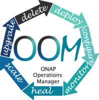

.. This work is licensed under a Creative Commons Attribution 4.0
.. International License.
.. http://creativecommons.org/licenses/by/4.0
.. Copyright (C) 2022 Nordix Foundation

.. Links
.. _Helm: https://docs.helm.sh/
.. _Helm Charts: https://github.com/kubernetes/charts
.. _Kubernetes: https://Kubernetes.io/
.. _Docker: https://www.docker.com/
.. _Nexus: https://nexus.onap.org/

.. _oom_dev_guide:

OOM Developer Guide
###################

ONAP consists of a large number of components, each of which are substantial
projects within themselves, which results in a high degree of complexity in
deployment and management. To cope with this complexity the ONAP Operations
Manager (OOM) uses a Helm_ model of ONAP - Helm being the primary management
system for Kubernetes_ container systems - to drive all user driven life-cycle
management operations. The Helm model of ONAP is composed of a set of
hierarchical Helm charts that define the structure of the ONAP components and
the configuration of these components.  These charts are fully parameterized
such that a single environment file defines all of the parameters needed to
deploy ONAP.  A user of ONAP may maintain several such environment files to
control the deployment of ONAP in multiple environments such as development,
pre-production, and production.

.. rubric:: Container Background

Linux containers allow for an application and all of its operating system
dependencies to be packaged and deployed as a single unit without including a
guest operating system as done with virtual machines. The most popular
container solution is Docker_ which provides tools for container management
like the Docker Host (dockerd) which can create, run, stop, move, or delete a
container. Docker has a very popular registry of containers images that can be
used by any Docker system; however, in the ONAP context, Docker images are
built by the standard CI/CD flow and stored in Nexus_ repositories. OOM uses
the "standard" ONAP docker containers and three new ones specifically created
for OOM.

Containers are isolated from each other primarily via name spaces within the
Linux kernel without the need for multiple guest operating systems. As such,
multiple containers can be deployed with little overhead such as all of ONAP
can be deployed on a single host. With some optimization of the ONAP components
(e.g. elimination of redundant database instances) it may be possible to deploy
ONAP on a single laptop computer.

The following sections describe how the ONAP Helm charts are constructed.

.. toctree::
  :maxdepth: 1

  oom_dev_helm_chart_info.rst
  oom_dev_config_management.rst
  oom_dev_container_orchestration.rst

