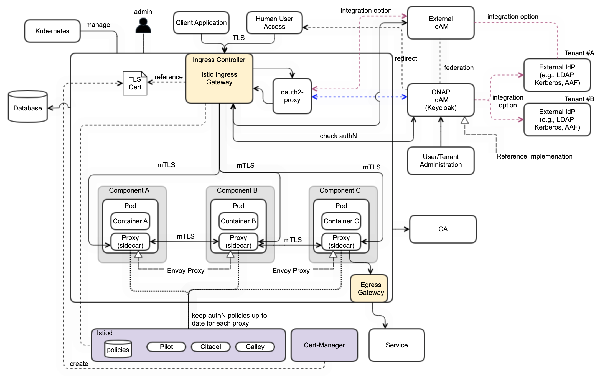

.. This work is licensed under a Creative Commons Attribution 4.0
.. International License.
.. http://creativecommons.org/licenses/by/4.0
.. Copyright (C) 2022 Nordix Foundation

.. Links
.. _Prometheus stack README: https://github.com/prometheus-community/helm-charts/tree/main/charts/kube-prometheus-stack#readme
.. _ONAP Next Generation Security & Logging Structure: https://wiki.onap.org/pages/viewpage.action?pageId=103417456
.. _Istio best practices: https://docs.solo.io/gloo-mesh-enterprise/latest/setup/prod/namespaces/
.. _Istio setup guide: https://istio.io/latest/docs/setup/install/helm/
.. _Kiali setup guide: https://kiali.io/docs/installation/installation-guide/example-install/

.. _oom_base_optional_addons:

OOM Optional Addons
###################

The following optional applications can be added to your kubernetes environment.

Install Prometheus Stack
************************

Prometheus is an open-source systems monitoring and alerting toolkit with
an active ecosystem.

Kube Prometheus Stack is a collection of Kubernetes manifests, Grafana
dashboards, and Prometheus rules combined with documentation and scripts to
provide easy to operate end-to-end Kubernetes cluster monitoring with
Prometheus using the Prometheus Operator. As it includes both Prometheus
Operator and Grafana dashboards, there is no need to set up them separately.
See the `Prometheus stack README`_ for more information.

To install the prometheus stack, execute the following:

- Add the prometheus-community Helm repository::

    > helm repo add prometheus-community https://prometheus-community.github.io/helm-charts

- Update your local Helm chart repository cache::

    > helm repo update

- To install prometheus, execute the following, replacing the <recommended-pm-version> with the version defined in the :ref:`versions_table` table::

    > helm install prometheus prometheus-community/kube-prometheus-stack --namespace=prometheus --create-namespace --version=<recommended-pm-version>

ONAP on Service Mesh
********************

.. warning::
    "ONAP on Service Mesh" is not fully supported in "Kohn". Full support is
    planned for London release to support the
    `ONAP Next Generation Security & Logging Structure`_

ONAP is currenty planned to support Istio as default ServiceMesh platform.
Therefor the following instructions describe the setup of Istio and required tools.
Used `Istio best practices`_ and `Istio setup guide`_

Istio Platform Installation
===========================

Install Istio Basic Platform
----------------------------

- Configure the Helm repository::

    > helm repo add istio https://istio-release.storage.googleapis.com/charts

    > helm repo update

- Create a namespace for "mesh-level" configurations::

    > kubectl create namespace istio-config

- Create a namespace istio-system for Istio components::

    > kubectl create namespace istio-system

- Install the Istio Base chart which contains cluster-wide resources used by the
  Istio control plane, replacing the <recommended-istio-version> with the version
  defined in the :ref:`versions_table` table::

    > helm upgrade -i istio-base istio/base -n istio-system --version <recommended-istio-version>

- Install the Istio Base Istio Discovery chart which deploys the istiod service, replacing the
  <recommended-istio-version> with the version defined in the :ref:`versions_table` table
  (enable the variable to enforce the (sidecar) proxy startup before the container start)::

    > helm upgrade -i istiod istio/istiod -n istio-system --version <recommended-istio-version>
    --wait --set global.proxy.holdApplicationUntilProxyStarts=true --set meshConfig.rootNamespace=istio-config

Add an EnvoyFilter for HTTP header case
---------------------------------------

When handling HTTP/1.1, Envoy will normalize the header keys to be all lowercase.
While this is compliant with the HTTP/1.1 spec, in practice this can result in issues
when migrating existing systems that might rely on specific header casing.
In our case a problem was detected in the SDC client implementation, which relies on
uppercase header values. To solve this problem in general we add a EnvoyFilter to keep
the uppercase header in the istio-config namespace to apply for all namespaces, but
set the context to SIDECAR_INBOUND to avoid problems in the connection between Istio-Gateway and Services

- Create a EnvoyFilter file (e.g. envoyfilter-case.yaml)

    .. collapse:: envoyfilter-case.yaml

      .. include:: ../../resources/yaml/envoyfilter-case.yaml
         :code: yaml

- Apply the change to Istio::

    > kubectl apply -f envoyfilter-case.yaml

Install Istio Gateway
---------------------

- Create a namespace istio-ingress for the Istio Ingress gateway
  and enable istio-injection::

    > kubectl create namespace istio-ingress

    > kubectl label namespace istio-ingress istio-injection=enabled

- Install the Istio Gateway chart,replacing the
  <recommended-istio-version> with the version defined in
  the :ref:`versions_table` table::

    > helm upgrade -i istio-ingressgateway istio/gateway -n istio-ingress
    --version <recommended-istio-version> --wait

Kiali Installation
==================

Kiali is used to visualize the Network traffic in a ServiceMesh enabled cluster
For setup the kiali operator is used, see `Kiali setup guide`_

- Install kiali-operator namespace::

    > kubectl create namespace kiali-operator

    > kubectl label namespace kiali-operator istio-injection=enabled

- Install the kiali-operator::

    > helm repo add kiali https://kiali.org/helm-charts

    > helm repo update kiali

    > helm install --namespace kiali-operator kiali/kiali-operator

- Create Kiali CR file (e.g. kiali.yaml)

    .. collapse:: kiali.yaml

      .. include:: ../../resources/yaml/kiali.yaml
         :code: yaml

- Install kiali::

    > kubectl apply -f kiali.yaml

- Create Ingress gateway entry for the kiali web interface
  using the configured Ingress <base-url> (here "simpledemo.onap.org")
  as described in :ref:`oom_customize_overrides`

    .. collapse:: kiali-ingress.yaml

      .. include:: ../../resources/yaml/kiali-ingress.yaml
         :code: yaml

- Add the Ingress entry for Kiali::

    > kubectl -n istio-system apply -f kiali-ingress.yaml

Jaeger Installation
===================

To be done...