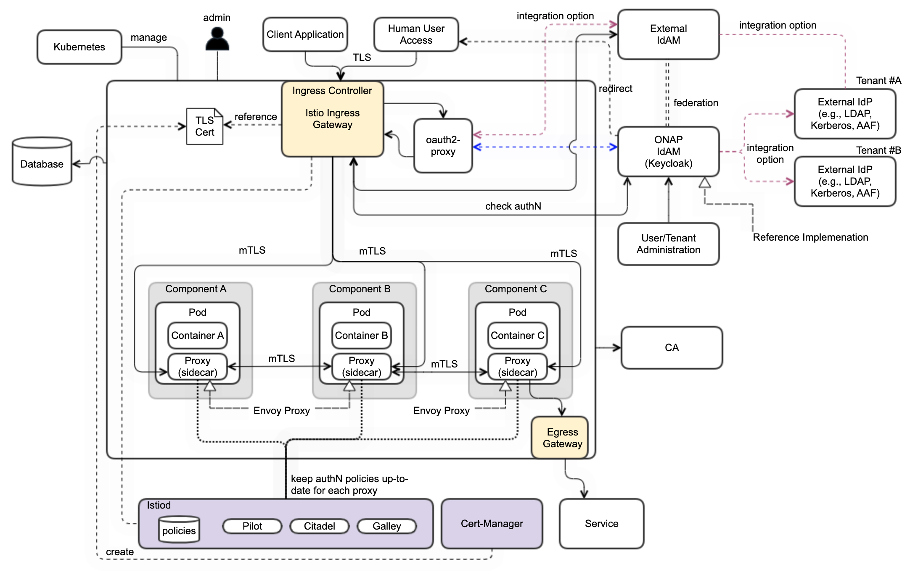

.. This work is licensed under a Creative Commons Attribution 4.0
.. International License.
.. http://creativecommons.org/licenses/by/4.0
.. Copyright (C) 2022 Nordix Foundation

.. Links
.. _Kubernetes: https://kubernetes.io/
.. _Kubernetes best practices: https://kubernetes.io/docs/setup/best-practices/cluster-large/
.. _kubelet config guide: https://kubernetes.io/docs/reference/command-line-tools-reference/kubelet/

ONAP Deployment Options
=======================

OOM supports 2 different deployment options of ONAP.

- Development Setup
- Production Setup

In the following sections describe the different setups.

Development setup
-----------------

The development setup deploys ONAP components exposing its external services
via NodePorts and without TLS termination and internal traffic encryption.

Production setup
----------------

The production setup deploys ONAP components exposing its external services
via Ingress with TLS termination.
Internal traffic encryption will be ensured by using Istio ServiceMesh.

For external access we start to establish Authentication via Oauth2-proxy
and Keycloak which will be completed in the coming release.
