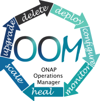
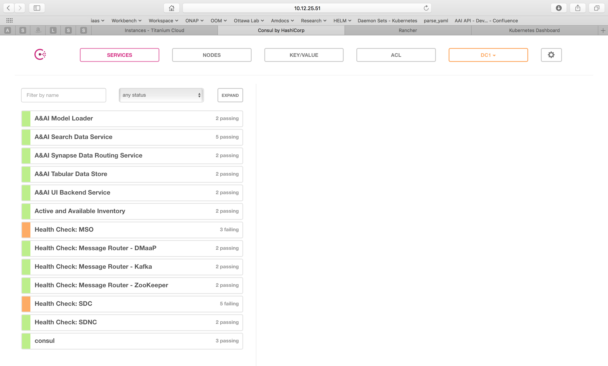
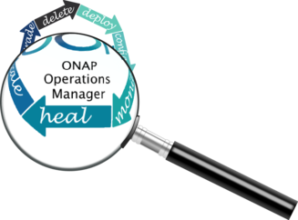
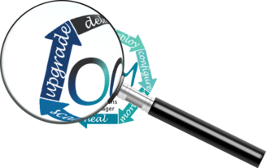

.. This work is licensed under a Creative Commons Attribution 4.0
.. International License.
.. http://creativecommons.org/licenses/by/4.0
.. Copyright (C) 2022 Nordix Foundation

.. Links
.. _Curated applications for Kubernetes: https://github.com/kubernetes/charts
.. _Services: https://kubernetes.io/docs/concepts/services-networking/service/
.. _ReplicaSet: https://kubernetes.io/docs/concepts/workloads/controllers/replicaset/
.. _StatefulSet: https://kubernetes.io/docs/concepts/workloads/controllers/statefulset/
.. _Helm Documentation: https://docs.helm.sh/helm/
.. _Helm: https://docs.helm.sh/
.. _Kubernetes: https://Kubernetes.io/
.. _Kubernetes LoadBalancer: https://kubernetes.io/docs/concepts/services-networking/service/#loadbalancer
.. _user-guide-label:

.. _oom_user_guide:

OOM User Guide
##############

.. warning::

    **THIS PAGE NEEDS TO BE EITHER REWRITTEN OR SOMETHING AS SOME INFO IS NO LONGER RELEVANT**

The ONAP Operations Manager (OOM) provide the ability to manage the entire
life-cycle of an ONAP installation, from the initial deployment to final
decommissioning. This guide provides instructions for users of ONAP to
use the Kubernetes_/Helm_ system as a complete ONAP management system.

This guide provides many examples of Helm command line operations.  For a
complete description of these commands please refer to the `Helm
Documentation`_.

The following sections describe the life-cycle operations:

- Deploy_ - with built-in component dependency management
- Configure_ - unified configuration across all ONAP components
- Monitor_ - real-time health monitoring feeding to a Consul UI and Kubernetes
- Heal_- failed ONAP containers are recreated automatically
- Scale_ - cluster ONAP services to enable seamless scaling
- Upgrade_ - change-out containers or configuration with little or no service impact
- Delete_ - cleanup individual containers or entire deployments

.. figure:: ../../resources/images/oom_logo/oomLogoV2-Deploy.png
   :align: right

Deploy
======

The OOM team with assistance from the ONAP project teams, have built a
comprehensive set of Helm charts, yaml files very similar to TOSCA files, that
describe the composition of each of the ONAP components and the relationship
within and between components. Using this model Helm is able to deploy all of
ONAP with a few simple commands.

Please refer to the :ref:`oom_deploy_guide` for deployment pre-requisites and options

.. note::
  Refer to the :ref:`oom_customize_overrides` section on how to update overrides.yaml and values.yaml

Configure
=========

Each project within ONAP has its own configuration data generally consisting
of: environment variables, configuration files, and database initial values.
Many technologies are used across the projects resulting in significant
operational complexity and an inability to apply global parameters across the
entire ONAP deployment. OOM solves this problem by introducing a common
configuration technology, Helm charts, that provide a hierarchical
configuration with the ability to override values with higher
level charts or command line options.

The structure of the configuration of ONAP is shown in the following diagram.
Note that key/value pairs of a parent will always take precedence over those
of a child. Also note that values set on the command line have the highest
precedence of all.

.. graphviz::

   digraph config {
      {
         node     [shape=folder]
         oValues  [label="values.yaml"]
         demo     [label="onap-demo.yaml"]
         prod     [label="onap-production.yaml"]
         oReq     [label="Chart.yaml"]
         soValues [label="values.yaml"]
         soReq    [label="Chart.yaml"]
         mdValues [label="values.yaml"]
      }
      {
         oResources  [label="resources"]
      }
      onap -> oResources
      onap -> oValues
      oResources -> environments
      oResources -> oReq
      oReq -> so
      environments -> demo
      environments -> prod
      so -> soValues
      so -> soReq
      so -> charts
      charts -> mariadb
      mariadb -> mdValues

   }

The top level onap/values.yaml file contains the values required to be set
before deploying ONAP.  Here is the contents of this file:

.. collapse:: Default ONAP values.yaml

    .. include:: ../../../../kubernetes/onap/values.yaml
       :code: yaml

|

One may wish to create a value file that is specific to a given deployment such
that it can be differentiated from other deployments.  For example, a
onap-development.yaml file may create a minimal environment for development
while onap-production.yaml might describe a production deployment that operates
independently of the developer version.

For example, if the production OpenStack instance was different from a
developer's instance, the onap-production.yaml file may contain a different
value for the vnfDeployment/openstack/oam_network_cidr key as shown below.

.. code-block:: yaml

  nsPrefix: onap
  nodePortPrefix: 302
  apps: consul msb mso message-router sdnc vid robot portal policy appc aai
  sdc dcaegen2 log cli multicloud clamp vnfsdk aaf kube2msb
  dataRootDir: /dockerdata-nfs

  # docker repositories
  repository:
    onap: nexus3.onap.org:10001
    oom: oomk8s
    aai: aaionap
    filebeat: docker.elastic.co

  image:
    pullPolicy: Never

  # vnf deployment environment
  vnfDeployment:
    openstack:
      ubuntu_14_image: "Ubuntu_14.04.5_LTS"
      public_net_id: "e8f51956-00dd-4425-af36-045716781ffc"
      oam_network_id: "d4769dfb-c9e4-4f72-b3d6-1d18f4ac4ee6"
      oam_subnet_id: "191f7580-acf6-4c2b-8ec0-ba7d99b3bc4e"
      oam_network_cidr: "192.168.30.0/24"
  <...>

To deploy ONAP with this environment file, enter::

  > helm deploy local/onap -n onap -f onap/resources/environments/onap-production.yaml --set global.masterPassword=password

.. collapse:: Default ONAP values.yaml

    .. include:: ../../resources/yaml/environments_onap_demo.yaml
       :code: yaml

|

When deploying all of ONAP, the dependencies section of the Chart.yaml file
controls which and what version of the ONAP components are included.
Here is an excerpt of this file:

.. code-block:: yaml

  dependencies:
  <...>
    - name: so
      version: ~12.0.0
      repository: '@local'
      condition: so.enabled
  <...>

The ~ operator in the `so` version value indicates that the latest "10.X.X"
version of `so` shall be used thus allowing the chart to allow for minor
upgrades that don't impact the so API; hence, version 10.0.1 will be installed
in this case.

The onap/resources/environment/dev.yaml (see the excerpt below) enables
for fine grained control on what components are included as part of this
deployment. By changing this `so` line to `enabled: false` the `so` component
will not be deployed.  If this change is part of an upgrade the existing `so`
component will be shut down. Other `so` parameters and even `so` child values
can be modified, for example the `so`'s `liveness` probe could be disabled
(which is not recommended as this change would disable auto-healing of `so`).

.. code-block:: yaml

  #################################################################
  # Global configuration overrides.
  #
  # These overrides will affect all helm charts (ie. applications)
  # that are listed below and are 'enabled'.
  #################################################################
  global:
  <...>

  #################################################################
  # Enable/disable and configure helm charts (ie. applications)
  # to customize the ONAP deployment.
  #################################################################
  aaf:
    enabled: false
  <...>
  so: # Service Orchestrator
    enabled: true

    replicaCount: 1

    liveness:
      # necessary to disable liveness probe when setting breakpoints
      # in debugger so K8s doesn't restart unresponsive container
      enabled: true

  <...>

Monitor
=======

All highly available systems include at least one facility to monitor the
health of components within the system.  Such health monitors are often used as
inputs to distributed coordination systems (such as etcd, Zookeeper, or Consul)
and monitoring systems (such as Nagios or Zabbix). OOM provides two mechanisms
to monitor the real-time health of an ONAP deployment:

- a Consul GUI for a human operator or downstream monitoring systems and
  Kubernetes liveness probes that enable automatic healing of failed
  containers, and
- a set of liveness probes which feed into the Kubernetes manager which
  are described in the Heal section.

Within ONAP, Consul is the monitoring system of choice and deployed by OOM in
two parts:

- a three-way, centralized Consul server cluster is deployed as a highly
  available monitor of all of the ONAP components, and
- a number of Consul agents.

The Consul server provides a user interface that allows a user to graphically
view the current health status of all of the ONAP components for which agents
have been created - a sample from the ONAP Integration labs follows:

To see the real-time health of a deployment go to: ``http://<kubernetes IP>:30270/ui/``
where a GUI much like the following will be found:

.. note::
  If Consul GUI is not accessible, you can refer this
  `kubectl port-forward <https://kubernetes.io/docs/tasks/access-application-cluster/port-forward-access-application-cluster/>`_ method to access an application

Heal
====

The ONAP deployment is defined by Helm charts as mentioned earlier.  These Helm
charts are also used to implement automatic recoverability of ONAP components
when individual components fail. Once ONAP is deployed, a "liveness" probe
starts checking the health of the components after a specified startup time.

Should a liveness probe indicate a failed container it will be terminated and a
replacement will be started in its place - containers are ephemeral. Should the
deployment specification indicate that there are one or more dependencies to
this container or component (for example a dependency on a database) the
dependency will be satisfied before the replacement container/component is
started. This mechanism ensures that, after a failure, all of the ONAP
components restart successfully.

To test healing, the following command can be used to delete a pod::

  > kubectl delete pod [pod name] -n [pod namespace]

One could then use the following command to monitor the pods and observe the
pod being terminated and the service being automatically healed with the
creation of a replacement pod::

  > kubectl get pods --all-namespaces -o=wide

Scale
=====

Many of the ONAP components are horizontally scalable which allows them to
adapt to expected offered load.  During the Beijing release scaling is static,
that is during deployment or upgrade a cluster size is defined and this cluster
will be maintained even in the presence of faults. The parameter that controls
the cluster size of a given component is found in the values.yaml file for that
component.  Here is an excerpt that shows this parameter:

.. code-block:: yaml

  # default number of instances
  replicaCount: 1

In order to change the size of a cluster, an operator could use a helm upgrade
(described in detail in the next section) as follows::

   > helm upgrade [RELEASE] [CHART] [flags]

The RELEASE argument can be obtained from the following command::

   > helm list

Below is the example for the same::

  > helm list
    NAME                    REVISION        UPDATED                         STATUS          CHART                   APP VERSION     NAMESPACE
    dev                     1               Wed Oct 14 13:49:52 2020        DEPLOYED        onap-12.0.0             london          onap
    dev-cassandra           5               Thu Oct 15 14:45:34 2020        DEPLOYED        cassandra-12.0.0                         onap
    dev-contrib             1               Wed Oct 14 13:52:53 2020        DEPLOYED        contrib-12.0.0                           onap
    dev-mariadb-galera      1               Wed Oct 14 13:55:56 2020        DEPLOYED        mariadb-galera-12.0.0                    onap

Here the Name column shows the RELEASE NAME, In our case we want to try the
scale operation on cassandra, thus the RELEASE NAME would be dev-cassandra.

Now we need to obtain the chart name for cassandra. Use the below
command to get the chart name::

  > helm search cassandra

Below is the example for the same::

  > helm search cassandra
    NAME                    CHART VERSION   APP VERSION     DESCRIPTION
    local/cassandra         12.0.0                          ONAP cassandra
    local/portal-cassandra  12.0.0                          Portal cassandra
    local/aaf-cass          12.0.0                          ONAP AAF cassandra
    local/sdc-cs            12.0.0                          ONAP Service Design and Creation Cassandra

Here the Name column shows the chart name. As we want to try the scale
operation for cassandra, thus the corresponding chart name is local/cassandra

Now we have both the command's arguments, thus we can perform the
scale operation for cassandra as follows::

  > helm upgrade dev-cassandra local/cassandra --set replicaCount=3

Using this command we can scale up or scale down the cassandra db instances.

The ONAP components use Kubernetes provided facilities to build clustered,
highly available systems including: Services_ with load-balancers, ReplicaSet_,
and StatefulSet_.  Some of the open-source projects used by the ONAP components
directly support clustered configurations, for example ODL and MariaDB Galera.

The Kubernetes Services_ abstraction to provide a consistent access point for
each of the ONAP components, independent of the pod or container architecture
of that component.  For example, SDN-C uses OpenDaylight clustering with a
default cluster size of three but uses a Kubernetes service to and change the
number of pods in this abstract this cluster from the other ONAP components
such that the cluster could change size and this change is isolated from the
other ONAP components by the load-balancer implemented in the ODL service
abstraction.

A ReplicaSet_ is a construct that is used to describe the desired state of the
cluster.  For example 'replicas: 3' indicates to Kubernetes that a cluster of 3
instances is the desired state.  Should one of the members of the cluster fail,
a new member will be automatically started to replace it.

Some of the ONAP components many need a more deterministic deployment; for
example to enable intra-cluster communication. For these applications the
component can be deployed as a Kubernetes StatefulSet_ which will maintain a
persistent identifier for the pods and thus a stable network id for the pods.
For example: the pod names might be web-0, web-1, web-{N-1} for N 'web' pods
with corresponding DNS entries such that intra service communication is simple
even if the pods are physically distributed across multiple nodes. An example
of how these capabilities can be used is described in the Running Consul on
Kubernetes tutorial.

Upgrade
=======

Helm has built-in capabilities to enable the upgrade of pods without causing a
loss of the service being provided by that pod or pods (if configured as a
cluster).  As described in the OOM Developer's Guide, ONAP components provide
an abstracted 'service' end point with the pods or containers providing this
service hidden from other ONAP components by a load balancer. This capability
is used during upgrades to allow a pod with a new image to be added to the
service before removing the pod with the old image. This 'make before break'
capability ensures minimal downtime.

Prior to doing an upgrade, determine of the status of the deployed charts::

  > helm list
  NAME REVISION UPDATED                  STATUS    CHART     NAMESPACE
  so   1        Mon Feb 5 10:05:22 2020  DEPLOYED  so-12.0.0 onap

When upgrading a cluster a parameter controls the minimum size of the cluster
during the upgrade while another parameter controls the maximum number of nodes
in the cluster.  For example, SNDC configured as a 3-way ODL cluster might
require that during the upgrade no fewer than 2 pods are available at all times
to provide service while no more than 5 pods are ever deployed across the two
versions at any one time to avoid depleting the cluster of resources. In this
scenario, the SDNC cluster would start with 3 old pods then Kubernetes may add
a new pod (3 old, 1 new), delete one old (2 old, 1 new), add two new pods (2
old, 3 new) and finally delete the 2 old pods (3 new).  During this sequence
the constraints of the minimum of two pods and maximum of five would be
maintained while providing service the whole time.

Initiation of an upgrade is triggered by changes in the Helm charts.  For
example, if the image specified for one of the pods in the SDNC deployment
specification were to change (i.e. point to a new Docker image in the nexus3
repository - commonly through the change of a deployment variable), the
sequence of events described in the previous paragraph would be initiated.

For example, to upgrade a container by changing configuration, specifically an
environment value::

  > helm upgrade so onap/so --version 12.0.1 --set enableDebug=true

Issuing this command will result in the appropriate container being stopped by
Kubernetes and replaced with a new container with the new environment value.

To upgrade a component to a new version with a new configuration file enter::

  > helm upgrade so onap/so --version 12.0.1 -f environments/demo.yaml

To fetch release history enter::

  > helm history so
  REVISION UPDATED                  STATUS     CHART     DESCRIPTION
  1        Mon Jul 5 10:05:22 2022  SUPERSEDED so-12.0.0 Install complete
  2        Mon Jul 5 10:10:55 2022  DEPLOYED   so-12.0.1 Upgrade complete

Unfortunately, not all upgrades are successful.  In recognition of this the
lineup of pods within an ONAP deployment is tagged such that an administrator
may force the ONAP deployment back to the previously tagged configuration or to
a specific configuration, say to jump back two steps if an incompatibility
between two ONAP components is discovered after the two individual upgrades
succeeded.

This rollback functionality gives the administrator confidence that in the
unfortunate circumstance of a failed upgrade the system can be rapidly brought
back to a known good state.  This process of rolling upgrades while under
service is illustrated in this short YouTube video showing a Zero Downtime
Upgrade of a web application while under a 10 million transaction per second
load.

For example, to roll-back back to previous system revision enter::

  > helm rollback so 1

  > helm history so
  REVISION UPDATED                  STATUS     CHART     DESCRIPTION
  1        Mon Jul 5 10:05:22 2022  SUPERSEDED so-12.0.0 Install complete
  2        Mon Jul 5 10:10:55 2022  SUPERSEDED so-12.0.1 Upgrade complete
  3        Mon Jul 5 10:14:32 2022  DEPLOYED   so-12.0.0 Rollback to 1

.. note::

  The description field can be overridden to document actions taken or include
  tracking numbers.

Many of the ONAP components contain their own databases which are used to
record configuration or state information.  The schemas of these databases may
change from version to version in such a way that data stored within the
database needs to be migrated between versions. If such a migration script is
available it can be invoked during the upgrade (or rollback) by Container
Lifecycle Hooks. Two such hooks are available, PostStart and PreStop, which
containers can access by registering a handler against one or both. Note that
it is the responsibility of the ONAP component owners to implement the hook
handlers - which could be a shell script or a call to a specific container HTTP
endpoint - following the guidelines listed on the Kubernetes site. Lifecycle
hooks are not restricted to database migration or even upgrades but can be used
anywhere specific operations need to be taken during lifecycle operations.

OOM uses Helm K8S package manager to deploy ONAP components. Each component is
arranged in a packaging format called a chart - a collection of files that
describe a set of k8s resources. Helm allows for rolling upgrades of the ONAP
component deployed. To upgrade a component Helm release you will need an
updated Helm chart. The chart might have modified, deleted or added values,
deployment yamls, and more.  To get the release name use::

  > helm ls

To easily upgrade the release use::

  > helm upgrade [RELEASE] [CHART]

To roll back to a previous release version use::

  > helm rollback [flags] [RELEASE] [REVISION]

For example, to upgrade the onap-so helm release to the latest SO container
release v1.1.2:

- Edit so values.yaml which is part of the chart
- Change "so: nexus3.onap.org:10001/openecomp/so:v1.1.1" to
  "so: nexus3.onap.org:10001/openecomp/so:v1.1.2"
- From the chart location run::

  > helm upgrade onap-so

The previous so pod will be terminated and a new so pod with an updated so
container will be created.

Delete
======

Existing deployments can be partially or fully removed once they are no longer
needed.  To minimize errors it is recommended that before deleting components
from a running deployment the operator perform a 'dry-run' to display exactly
what will happen with a given command prior to actually deleting anything.
For example::

  > helm undeploy onap --dry-run

will display the outcome of deleting the 'onap' release from the
deployment.
To completely delete a release and remove it from the internal store enter::

  > helm undeploy onap

Once complete undeploy is done then delete the namespace as well
using following command::

  >  kubectl delete namespace <name of namespace>

.. note::
   You need to provide the namespace name which you used during deployment,
   below is the example::

   >  kubectl delete namespace onap

One can also remove individual components from a deployment by changing the
ONAP configuration values.  For example, to remove `so` from a running
deployment enter::

  > helm undeploy onap-so

will remove `so` as the configuration indicates it's no longer part of the
deployment. This might be useful if a one wanted to replace just `so` by
installing a custom version.
